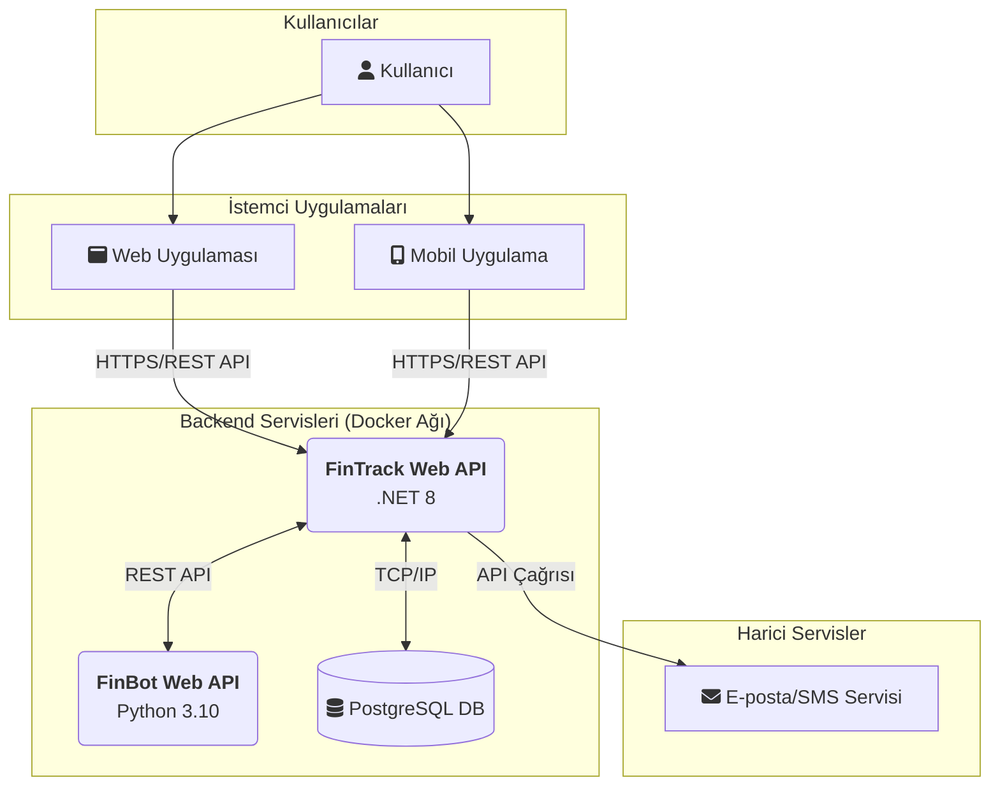
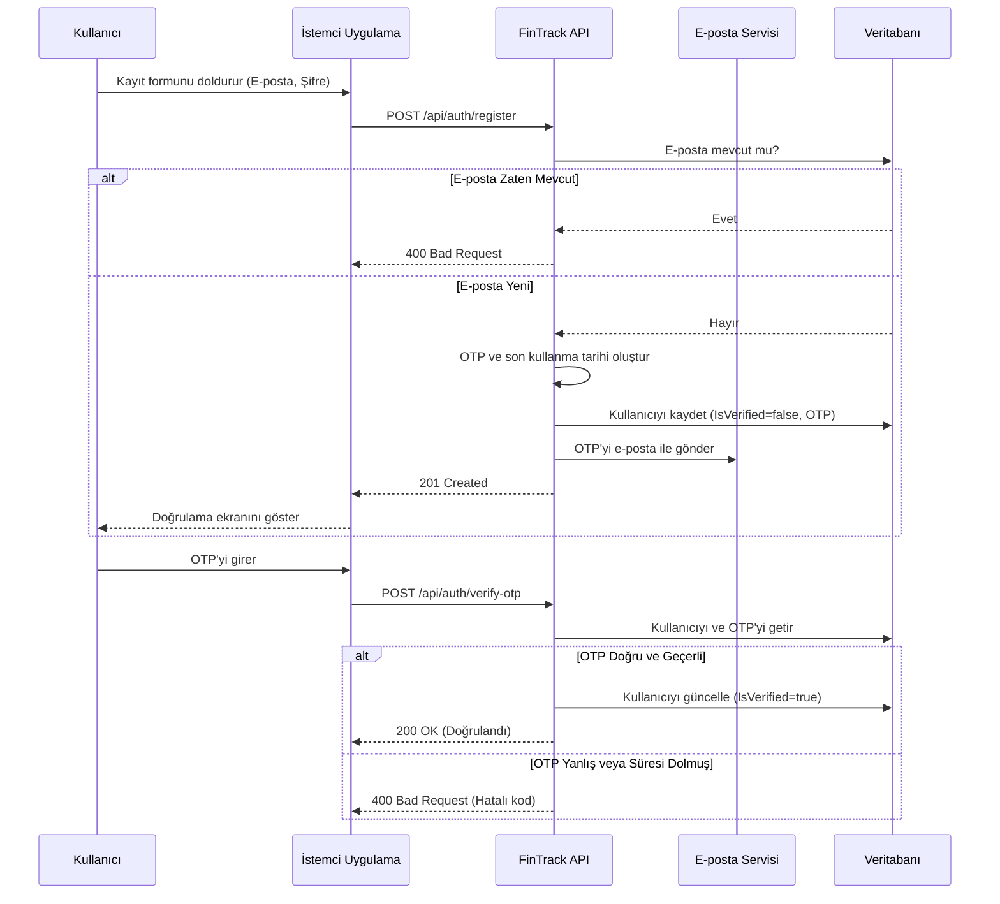
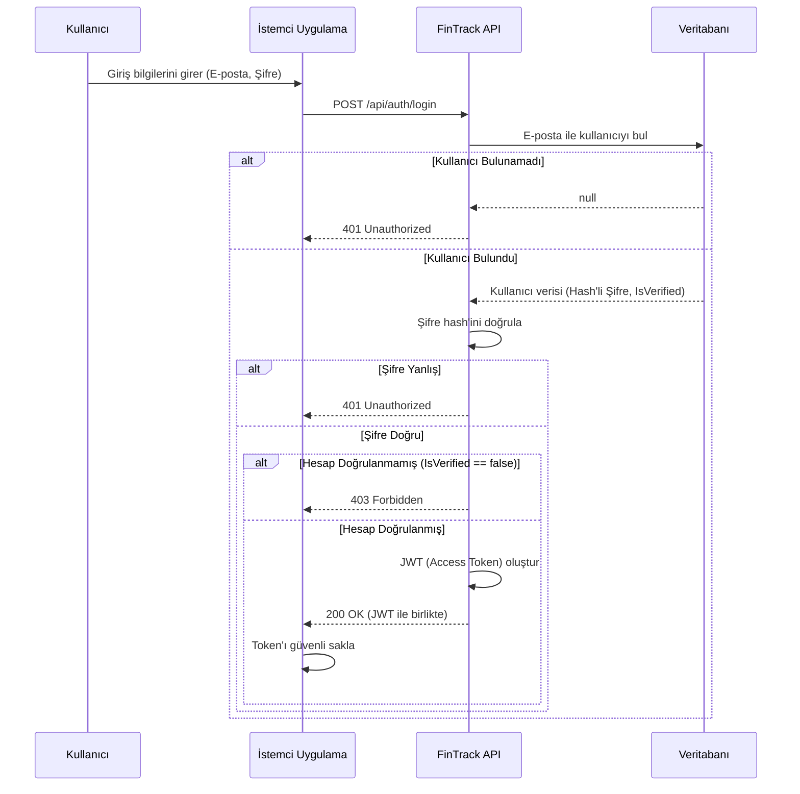

# FinTrack Projesi Sistem Mimarisi

Bu doküman, FinTrack platformunun teknik mimarisi, temel bileşenleri, teknolojileri ve aralarındaki etkileşimler hakkında üst düzey bir genel bakış sunmaktadır.

## 1. Genel Bakış ve Mimari Yaklaşım

FinTrack, kişisel finans yönetimi için tasarlanmış, **konteyner tabanlı (containerized)** ve **mikroservis odaklı** bir mimari üzerine inşa edilmiştir. Sistem, Docker ve Docker Compose kullanılarak yönetilen, birbirinden bağımsız ancak birbirleriyle iletişim halinde olan servislerden oluşur. Bu yaklaşım, geliştirme ortamının standartlaştırılmasını, dağıtımın kolaylaştırılmasını ve sistemin ölçeklenebilirliğini artırmayı hedefler.

## 2. Üst Düzey Mimari Diyagramı

Aşağıdaki diyagram, sistemin ana bileşenlerini ve aralarındaki temel veri akışını göstermektedir.



## 3. Temel Bileşenler

### 3.1. FinTrack Web API (`fintrackwebapi`)
- **Teknoloji:** .NET 8, ASP.NET Core, Entity Framework Core
- **Sorumluluklar:**
    - Sistemin ana beyni ve giriş kapısıdır.
    - Kullanıcı yetkilendirme (kayıt, giriş, JWT oluşturma) ve yönetimi.
    - Tüm temel CRUD (Oluştur, Oku, Güncelle, Sil) işlemleri (Hesaplar, Kategoriler, İşlemler, Bütçeler).
    - Veritabanı ile doğrudan iletişim.
    - Gerekli durumlarda `FinBot Web API`'sine istek göndermek.
    - OTP gönderme gibi işlemler için harici e-posta servislerini tetiklemek.

### 3.2. FinBot Web API (`finbotwebapi`)
- **Teknoloji:** Python 3.10, FastAPI
- **Sorumluluklar:**
    - Ana API'nin yükünü hafifleten yardımcı ve asenkron görevleri yürütür.
    - Kategori önerileri, harcama analizi raporları oluşturma veya yapay zeka tabanlı işlemler gibi özellikler için tasarlanmıştır.
    - `FinTrack Web API`'sinden gelen istekleri işler.

### 3.3. PostgreSQL Veritabanı (`db_postgres`)
- **Teknoloji:** PostgreSQL 15
- **Sorumluluklar:**
    - Uygulamanın tüm ilişkisel verilerini (kullanıcılar, hesaplar, işlemler vb.) kalıcı olarak depolar.
    - `docker-compose.yml` dosyasında tanımlanan bir Docker volume'ü (`postgres_data`) sayesinde verilerin konteyner durdurulsa bile korunmasını sağlar.

### 3.4. İstemci Uygulamaları (Client Applications)
- **Teknoloji:** Web için React/Angular/Vue, Mobil için React Native/Flutter/Swift/Kotlin olabilir.
- **Sorumluluklar:**
    - Kullanıcı arayüzünü sunar.
    - Kullanıcı etkileşimlerini alır ve bunları `FinTrack Web API`'sine RESTful API çağrılarına dönüştürür.
    - API'den gelen JWT'yi güvenli bir şekilde saklar ve sonraki isteklerde kullanır.

## 4. Teknoloji Stack'i
- **Backend:** .NET 8, Python 3.10, ASP.NET Core, FastAPI
- **Veritabanı:** PostgreSQL 15, Entity Framework Core
- **Konteynerleştirme:** Docker, Docker Compose
- **Mimari Stili:** Mikroservis-odaklı, RESTful API
- **Yetkilendirme:** JSON Web Tokens (JWT)

## 5. Detaylı Süreç Akışları (Sequence Diagrams)

Sistemin en kritik kullanıcı akışları aşağıda detaylandırılmıştır.

<details>
<summary><b>Akış 1: Yeni Kullanıcı Kaydı ve OTP ile Doğrulama</b> (Genişletmek için tıklayın)</summary>


</details>

<details>
<summary><b>Akış 2: Kullanıcı Girişi (Login) ve JWT Alma</b> (Genişletmek için tıklayın)</summary>


</details>

## 6. Ağ ve Servis İletişimi (Networking)

- Tüm backend servisleri, `docker-compose.yml` içinde tanımlanan `fintrac_network` adlı özel bir "bridge" ağı üzerinde çalışır.
- Bu ağ sayesinde servisler, birbirleriyle doğrudan konteyner isimlerini kullanarak güvenli bir şekilde iletişim kurabilir. Örneğin, `FinTrack Web API` veritabanına `Host=db_postgres` adresi üzerinden erişir.
- Dış dünyaya sadece `fintrackwebapi` (Port `5000`) ve `finbotwebapi` (Port `5001`) servislerinin portları açılmıştır. Veritabanı portu (`5433`) ise sadece yerel makineden erişim ve yönetim kolaylığı için dışarıya açılmıştır, canlı (production) ortamlarda bu portun kapatılması önerilir.
```