# FinansTakipApp API <!-- Projenizin adını buraya yazın -->

[](https://github.com/kullanici_adiniz/proje_adiniz/actions) <!-- CI/CD kullanıyorsanız güncelleyin -->
[](LICENSE) <!-- Lisans türünüze göre güncelleyin -->
[](https://dotnet.microsoft.com/download/dotnet/8.0) <!-- Kullandığınız .NET versiyonunu belirtin -->
[](https://www.docker.com/)

**Mikroservis Mimarisi ile Geliştirilmiş Finansal Takip Uygulaması**

Bu repository, FinTrack adlı finansal takip uygulamasının mikroservis mimarisi ile geliştirilmiş backend hizmetlerini içerir. Proje, ana API servisi (FinTrackWebApi), yönetim paneli (WinTrackManagerPanel) ve ChatBot servisi (FinBotWebApi) olmak üzere üç ana mikroservisten oluşmaktadır.

---

## İçindekiler

- Genel Bakış
- Mimari Yapı
- Özellikler
- Kullanılan Teknolojiler
- Ön Gereksinimler
- Kurulum
- Docker ile Çalıştırma
- Yapılandırma
- API Kullanımı ve Uç Noktalar (Endpoints)
- Testleri Çalıştırma
- Katkıda Bulunma
- Lisans
- İletişim

---

## Genel Bakış

FinTrack, modern mikroservis mimarisi kullanılarak geliştirilmiş, kullanıcıların kişisel finanslarını etkin bir şekilde yönetmelerine olanak tanıyan kapsamlı bir finansal takip ve yönetim platformudur. Sistem, bütçe oluşturma, gelir-gider takibi, hesap yönetimi, güncel kur bilgileri ve ChatBot destekli etkileşim gibi zengin özellikler sunar.

---

## Mimari Yapı

Proje, aşağıdaki mikroservislerden oluşmaktadır:

1. **FinTrackWebApi (Ana API Servisi)**
   - Kullanıcı yönetimi
   - Hesap ve işlem yönetimi
   - Bütçe yönetimi
   - Raporlama servisleri

2. **WinTrackManagerPanel (Yönetim Paneli)**
   - Sistem yönetimi
   - Kullanıcı yönetimi
   - İçerik moderasyonu
   - Sistem izleme ve raporlama

3. **FinBotWebApi (ChatBot Servisi)**
   - Kullanıcı destek sistemi
   - Finansal tavsiyeler
   - Otomatik yanıt sistemi

Her mikroservis kendi veritabanına sahiptir ve Docker konteynerleri içinde çalışmaktadır.

---

## Özellikler

✨ **Temel Özellikler:**

*   **Kullanıcı Yönetimi:** Kayıt olma, giriş yapma, profil yönetimi (JWT tabanlı kimlik doğrulama).
*   **Hesap Yönetimi:** Banka hesapları, kredi kartları, nakit vb. hesap tanımlama ve yönetimi.
*   **İşlem Yönetimi:** Gelir ve gider kayıtları ekleme, düzenleme, silme ve listeleme.
*   **Kategorizasyon:** İşlemleri özel veya ön tanımlı kategorilere ayırma.
*   **Bütçe Yönetimi:** Belirli kategoriler veya genel harcamalar için aylık/yıllık bütçe oluşturma ve takip etme.
*   **Raporlama:** Aylık özetler, kategori bazlı harcama analizleri, gelir-gider grafikleri.
*   **Para Birimi Desteği:** Farklı para birimleri ile işlem yapabilme.
*   **Güvenlik:** Güvenli kimlik doğrulama, yetkilendirme ve veri koruma mekanizmaları.
*   **ChatBot Desteği:** Finansal tavsiyeler ve kullanıcı desteği için yapay zeka destekli chatbot.
*   **Yönetim Paneli:** Kapsamlı sistem yönetimi ve izleme araçları.

---

## Kullanılan Teknolojiler

*   **Framework:** ASP.NET Core 8.0
*   **Dil:** C#
*   **Veritabanı:** PostgreSQL
*   **ORM:** Entity Framework Core 8.0
*   **API Dokümantasyonu:** Swagger
*   **Kimlik Doğrulama:** JWT (JSON Web Tokens)
*   **Mimari:** Mikroservis Mimarisi
*   **Containerization:** Docker
*   **Orchestration:** Docker Compose
*   **Dependency Injection:** .NET Core Dahili DI Container
*   **Logging:** .NET Core Dahili Logging
*   **Ödeme Sistemi:** Stripe
*   **Döviz Kuru API:** CurrencyFreaks
*   **ChatBot:** Python tabanlı özel chatbot servisi

---

## Ön Gereksinimler

Projeyi yerel makinenizde çalıştırmak veya geliştirmek için aşağıdaki araçların kurulu olması gerekmektedir:

*   [.NET SDK](https://dotnet.microsoft.com/download) (8.0 veya üzeri)
*   [Visual Studio 2022](https://visualstudio.microsoft.com/vs/) / [Visual Studio Code](https://code.visualstudio.com/)
*   [Docker Desktop](https://www.docker.com/products/docker-desktop/)
*   [pgAdmin](https://www.pgadmin.org/)
*   [Git](https://git-scm.com/)
*   [Python](https://www.python.org/) (ChatBot servisi için)

---

## Kurulum

### Docker ile Kurulum (Önerilen)

1. **Repository'yi Klonlayın:**
    ```bash
    git clone https://github.com/kullanici_adiniz/proje_adiniz.git
    cd proje_adiniz
    ```

2. **Docker Compose ile Servisleri Başlatın:**
    ```bash
    docker-compose up -d
    ```

Bu komut, tüm mikroservisleri ve gerekli veritabanlarını otomatik olarak başlatacaktır.

### Manuel Kurulum

Her bir mikroservis için ayrı kurulum adımları:

1. **FinTrackWebApi Kurulumu:**
    ```bash
    cd FinTrackWebApi
    dotnet restore
    dotnet build
    dotnet run
    ```

2. **WinTrackManagerPanel Kurulumu:**
    ```bash
    cd WinTrackManagerPanel
    dotnet restore
    dotnet build
    dotnet run
    ```

3. **FinBotWebApi Kurulumu:**
    ```bash
    cd FinBotWebApi
    pip install -r requirements.txt
    python app.py
    ```

---

## Docker ile Çalıştırma

Proje, Docker ve Docker Compose kullanılarak kolayca çalıştırılabilir. Tüm servisler ve bağımlılıklar otomatik olarak yapılandırılır.

1. **Tüm Servisleri Başlatma:**
    ```bash
    docker-compose up -d
    ```

2. **Belirli Bir Servisi Başlatma:**
    ```bash
    docker-compose up -d fintrackwebapi
    ```

3. **Servisleri Durdurma:**
    ```bash
    docker-compose down
    ```

4. **Logları Görüntüleme:**
    ```bash
    docker-compose logs -f
    ```

---

## Yapılandırma

Her mikroservis kendi yapılandırma dosyalarına sahiptir. Temel yapılandırmalar `appsettings.json` ve ortama özel `appsettings.{Environment}.json` dosyaları üzerinden yapılır.

Örnek bir `appsettings.json` dosya yapısı:
```json
{
  "ConnectionStrings": {
    "DefaultConnection": "Host=localhost;Port=5433;Database=YOUR_DBNAME;Username=postgres;Password=YOUR_PASSWORD"
  },

  "Token": {
    "Issuer": "http://localhost:5246",
    "Audience": "http://localhost:5246",
    "SecurityKey": "YOUR_SECURITY_KEY",
    "Expiration": "YOUR_EXPIRATION"
  },

  "SMTP": {
    "NetworkCredentialMail": "YOUR_NETWORK_CREDENTIAL_MAIL",
    "NetworkCredentialPassword": "YOUR_NETWORK_CREDENTIAL_PASSWORD",
    "Host": "YOUR_HOST",
    "Port": 000,
    "SenderMail": "YOUR_SENDER_MAIL",
    "SenderName": "FinTrack"
  },

  "StripeSettings": {
    "PublishableKey": "YOUR_PUBLISHABLE_KEY",
    "SecretKey": "YOUR_SECRET_KEY",
    "WebhookSecret": "YOUR_HOOK_SECRET",
    "FreeMembership": "YOUR_FREE_MEMBERSHIP",
    "PlusMembership": "YOUR_PLUS_MEMBERSHIP",
    "ProMembership": "YOUR_PRO_MEMBERSHIP"
  },

  "CurrencyFreaks": {
    "ApiKey": "YOUR_API_KEY",
    "BaseUrl": "https://api.currencyfreaks.com/v2.0/",
    "SupportedCurrenciesUrl": "https://api.currencyfreaks.com/v2.0/supported-currencies",
    "UpdateIntervalMinutes": 1440
  },

  "PythonChatBotService": {
    "Url": "http://finbotwebapi:8000/chat"
  },

  "FilePaths": {
    "UnapprovedVideos": "C:\\Path\\To\\UnapprovedVideos",
    "EncryptedVideos": "C:\\Path\\To\\EncryptedVideos"
  },

  "Logging": {
    "LogLevel": {
      "Default": "Information",
      "Microsoft.AspNetCore": "Warning"
    }
  },
  "AllowedHosts": "*"
}
```

**Güvenlik Notu:** Üretim ortamı için hassas yapılandırma bilgilerini asla kaynak kod deposuna göndermeyin. Ortam Değişkenleri, Azure Key Vault, AWS Secrets Manager veya HashiCorp Vault gibi güvenli yapılandırma yönetimi çözümlerini kullanın.

---

## API Kullanımı ve Uç Noktalar (Endpoints)

Her mikroservis kendi API dokümantasyonuna sahiptir. Swagger UI üzerinden erişilebilir:

* **FinTrackWebApi:** `https://localhost:5246/swagger`
* **WinTrackManagerPanel:** `https://localhost:5247/swagger`
* **FinBotWebApi:** `https://localhost:8000/docs`

---

## Testleri Çalıştırma

Her mikroservis için testleri ayrı ayrı çalıştırabilirsiniz:

```bash
# FinTrackWebApi testleri
cd FinTrackWebApi
dotnet test

# WinTrackManagerPanel testleri
cd WinTrackManagerPanel
dotnet test

# FinBotWebApi testleri
cd FinBotWebApi
pytest
```

## Veri Tabanı

```mermaid
erDiagram
    Users {
        int UserId PK
        string Username
        string Email
        string PasswordHash
        string ProfilePicture
        datetime CreateAt
    }

    UserSettings {
        int SettingsId PK
        int UserId FK
        string Theme
        string Language
        string Currency
        bool Notification
        datetime EntryDate
    }

    OtpVerification {
        int OtpId PK
        string Email
        string OtpCode
        datetime CreateAt
        datetime ExpireAt
        string Username "Temporary holder for registration"
        string PasswordHash "Temporary holder for registration"
        string ProfilePicture "Temporary holder for registration"
        int UserModelUserId FK "References Users.UserId"
    }

    Accounts {
        int AccountId PK
        int UserId FK
        string Name
        string AccountType
        bool IsActive
        decimal Balance
        datetime CreateAt
        datetime UpdateAt
    }

    Transactions {
        int TransactionId PK
        int UserId FK
        int AccountId FK
        int CategoryId FK
        decimal Amount
        datetime TransactionDate
        string Description
        datetime CreatedAt
        datetime UpdatedAt
        string Type "Income, Expense"
    }

    Categories {
        int CategoryId PK
        int UserId FK "Nullable if global categories allowed"
        string CategoryName
        string CategoryType "Income, Expense, Transfer"
    }

    Budgets {
        int BudgetId PK
        int UserId FK
        string BudgetName
        string Description
        datetime StartDate
        datetime EndDate
        bool IsActive
        datetime CreatedAtUtc
        datetime UpdatedAtUtc
    }

    BudgetCategories {
        int BudgetCategoryId PK
        int BudgetId FK
        int CategoryId FK
        decimal AllocatedAmount
    }

    Notifications {
        int NotificationId PK
        int UserId FK
        string MessageHead
        string MessageBody
        string NotificationType
        datetime CreatedAtUtc
        bool IsRead
    }

    MembershipPlans {
        int MembershipPlanId PK
        string Name
        string Description
        decimal Price
        string Currency
        string BillingCycle "Monthly, Yearly"
        int DurationInDays
        string Features
        bool IsActive
    }

    UserMemberships {
        int UserMembershipId PK
        int UserId FK
        int MembershipPlanId FK
        datetime StartDate
        datetime EndDate
        string Status
        bool AutoRenew
        datetime CancellationDate
    }

    Payments {
        int PaymentId PK
        int UserId FK
        int UserMembershipId FK "Nullable if payment not for membership"
        datetime PaymentDate
        decimal Amount
        string Currency
        string Status
        string GatewayResponse
        string Notes
        string PaymentMethod
        string TransactionId "Gateway's transaction ID"
    }

    Currencies {
        int CurrencyId PK
        string Code
        string Name
        string CountryCode
        string CountryName
        string Status
        datetime AvailableFrom
        datetime AvailableUntil
        string IconUrl
        datetime CreatedUtc
    }

    CurrencySnapshots {
        int CurrencySnapshotId PK
        datetime FetchTimestamp
        string BaseCurrency
    }

    ExchangeRates {
        int ExchangeRateId PK
        int CurrencyId FK "Target Currency"
        int CurrencySnapshotId FK
        decimal Rate
    }

    Debts {
        int DebtId PK
        int LenderId FK "References Users.UserId"
        int BorrowerId FK "References Users.UserId"
        int VideoMetadataId FK "Optional: if debt is related to a video"
        int CurrencyId FK
        decimal Amount
        string Description
        datetime CreateAtUtc
        datetime DueDateUtc
        string Status
        datetime UpdatedAtUtc
    }

    VideoMetadatas {
        int VideoMetadataId PK
        int DebtId FK "Optional: If this video is collateral or related to a debt"
        int UploadedByUserId FK "References Users.UserId"
        string OriginalFileName
        string StoredFileName
        long FileSize
        string ContentType
        datetime UploadDateUtc
        string StorageType
        timespan Duration
        string EncryptedFilePath
        string EncryptionIV
        string EncryptionKeyHash
        string EncryptionSalt
        string Status
        string UnencryptedFilePath "Temp path before encryption"
    }

    Employees {
        int EmployeeId PK
        string Name
        string Email
        string PhoneNumber
        string Position
        datetime HireDate
        decimal Salary
        bool IsActive
        datetime CreatedAtUtc
        datetime UpdatedAtUtc
        int CreatedBy "Potentially FK to Employees.EmployeeId"
        int UpdatedBy "Potentially FK to Employees.EmployeeId"
        string ProfilePictureUrl
        string Notes
        string Password "For internal system access"
    }

    Departments {
        int DepartmentId PK
        string Name
        string Description
        datetime CreatedAtUtc
        datetime UpdatedAtUtc
        int CreatedBy "Potentially FK to Employees.EmployeeId"
        int UpdatedBy "Potentially FK to Employees.EmployeeId"
    }

    EmployeeDepartments {
        int EmployeeDepartmentId PK "Usually composite from EmployeeId, DepartmentId"
        int EmployeeId FK
        int DepartmentId FK
        datetime CreatedAtUtc
        datetime UpdatedAtUtc
        int CreatedBy "Potentially FK to Employees.EmployeeId"
        string Notes
    }

    __EFMigrationsHistory {
        string MigrationId PK
        string ProductVersion
    }

    Users ||--o{ UserSettings : "has"
    Users ||--o| OtpVerification : "verifies_with (UserModelUserId)"
    Users ||--o{ Accounts : "owns"
    Users ||--o{ Transactions : "performs"
    Users ||--o{ Categories : "creates"
    Users ||--o{ Budgets : "defines"
    Users ||--o{ Notifications : "receives"
    Users ||--o{ UserMemberships : "has"
    Users ||--o{ Payments : "makes"
    Users ||--o{ Debts : "lender_of"
    Users ||--o{ Debts : "borrower_of"
    Users ||--o{ VideoMetadatas : "uploads"

    Accounts ||--o{ Transactions : "associated_with"
    Categories ||--o{ Transactions : "categorizes"
    Budgets ||--o{ BudgetCategories : "contains"
    Categories ||--o{ BudgetCategories : "part_of_budget"

    MembershipPlans ||--o{ UserMemberships : "offers"
    UserMemberships ||--o{ Payments : "paid_by"

    Currencies ||--o{ ExchangeRates : "target_for"
    CurrencySnapshots ||--o{ ExchangeRates : "snapshot_for"
    Currencies ||--o{ Debts : "currency_for"

    VideoMetadatas ||--o| Debts : "secures (VideoMetadataId in Debts)"
    Debts ||--o| VideoMetadatas : "related_to (DebtId in VideoMetadatas)"

    Employees ||--o{ EmployeeDepartments : "belongs_to"
    Departments ||--o{ EmployeeDepartments : "has_employee_in"

    "Audit/System Tables"
    "__EFMigrationsHistory: tracks EF Core migrations"
    "Employees.CreatedBy/UpdatedBy may FK to Employees.EmployeeId"
    "Departments.CreatedBy/UpdatedBy may FK to Employees.EmployeeId"
    "EmployeeDepartments.CreatedBy may FK to Employees.EmployeeId"
```



---

## Katkıda Bulunma

1. Bu repository'yi fork edin
2. Yeni bir branch oluşturun (`git checkout -b feature/amazing-feature`)
3. Değişikliklerinizi commit edin (`git commit -m 'Add some amazing feature'`)
4. Branch'inizi push edin (`git push origin feature/amazing-feature`)
5. Pull Request oluşturun

---

## Lisans

Bu proje GPL lisansı altında lisanslanmıştır. Detaylar için [LICENSE](LICENSE) dosyasına bakın.

---

## İletişim

Proje ile ilgili sorularınız veya geri bildirimleriniz için:

*   **Proje Sahibi:** Enes Efe Tokta - [enesefetokta@gmail.com](mailto:enesefetokta@gmail.com)
*   **LinkedIn:** [https://www.linkedin.com/in/enes-efe-tokta/](https://www.linkedin.com/in/enes-efe-tokta/)
*   **Project Link:** [https://github.com/EnesEfeTokta/FluxNews](https://github.com/EnesEfeTokta/FinTrackWebApi)
