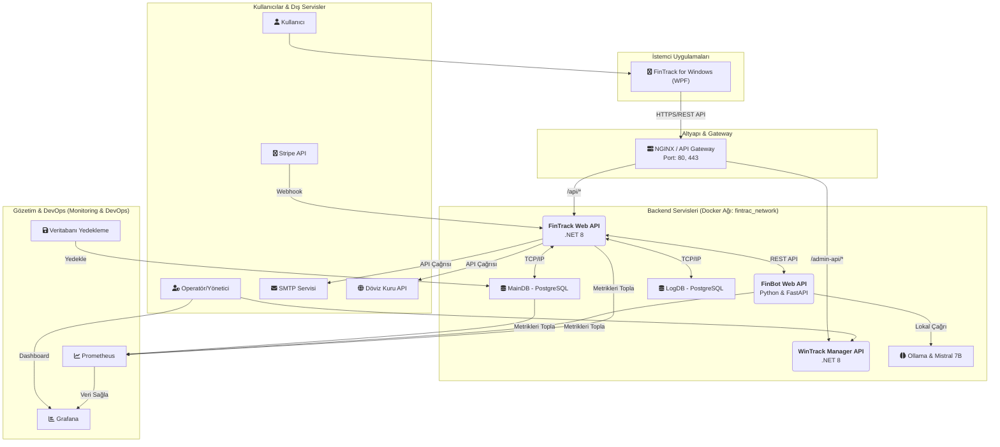
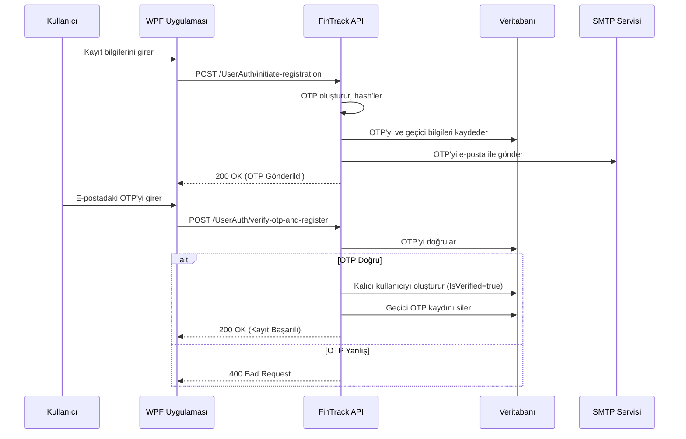
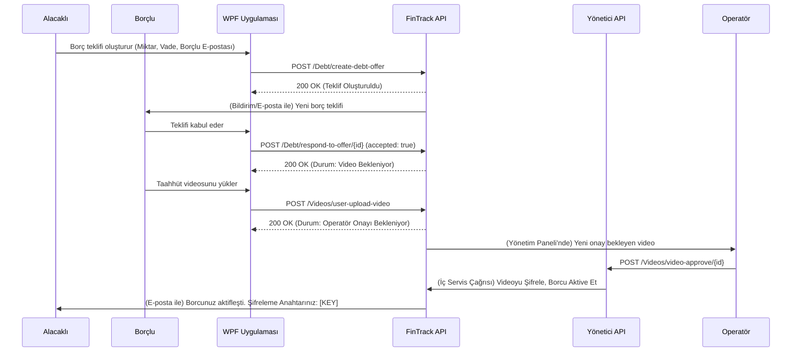
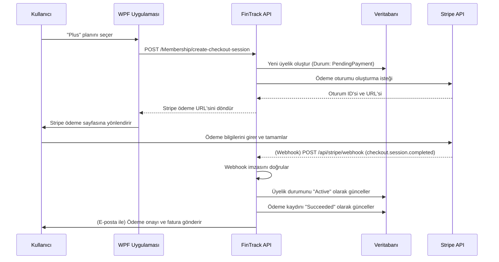

# FinTrack Projesi: Sistem Mimarisi ve Teknik Dokümantasyon

Bu doküman, FinTrack platformunun teknik mimarisini, temel bileşenlerini, teknolojilerini, veri akışlarını ve aralarındaki etkileşimleri detaylı bir şekilde açıklamaktadır.

## 1. Genel Bakış ve Mimari Yaklaşım

FinTrack, **konteyner tabanlı (containerized)** ve **mikroservis odaklı** bir mimari üzerine inşa edilmiştir. Sistem, Docker ve Docker Compose kullanılarak yönetilen, birbirinden bağımsız ancak birbirleriyle API'ler üzerinden haberleşen servislerden oluşur. Bu yaklaşım, aşağıdaki avantajları sağlar:
*   **Ölçeklenebilirlik:** Her servis, ihtiyaç duyulduğunda bağımsız olarak ölçeklendirilebilir.
*   **Esneklik:** Her servis, kendi görevine en uygun teknoloji yığını ile geliştirilebilir (örn: .NET ve Python'un bir arada kullanılması).
*   **Bakım Kolaylığı:** Bir serviste yapılan değişiklik, diğer servisleri doğrudan etkilemez.
*   **Dağıtım Kolaylığı:** Tüm altyapı, Docker ile tek bir komutla ayağa kaldırılabilir.

## 2. Üst Düzey Mimari Diyagramı

Aşağıdaki diyagram, sistemin ana bileşenlerini, aralarındaki temel veri akışını ve dış dünya ile olan etkileşimini göstermektedir.

## 3. Temel Bileşenler

### 3.1. Ana Backend Servisleri

*   **FinTrack Web API (`fintrack_api`):**
    *   **Teknoloji:** .NET 8, ASP.NET Core, Entity Framework Core.
    *   **Sorumluluklar:** Sistemin ana beynidir. Kullanıcı yetkilendirme (OTP, JWT), hesap/bütçe/işlem yönetimi, raporlama, Güvenli Borç Sistemi (GBS) iş mantığı, Stripe ödeme oturumu başlatma ve webhook dinleme gibi tüm temel işlevleri yürütür.
*   **FinBot Web API (`finbot_api`):**
    *   **Teknoloji:** Python, FastAPI.
    *   **Sorumluluklar:** Yapay zeka operasyonlarını yönetir. `FinTrack Web API`'sinden gelen kullanıcı sorgularını alır, `Ollama` servisi aracılığıyla Mistral 7B dil modeline iletir ve anlamlı yanıtlar üreterek geri döner.
*   **WinTrack Manager Panel (`wintrack_manager`):**
    *   **Teknoloji:** .NET 8, ASP.NET Core.
    *   **Sorumluluklar:** Yöneticiler ve operatörler için tasarlanmış bir API'dir. GBS'deki video onaylama/reddetme süreçleri, kullanıcı yönetimi, sistem genelindeki verileri izleme gibi idari fonksiyonları barındırır.

### 3.2. Veritabanı Mimarisi

*   **MainDB (`postgres_db`):**
    *   **Teknoloji:** PostgreSQL 15.
    *   **Sorumluluklar:** Ana uygulama verilerini (kullanıcılar, hesaplar, üyelikler, borçlar vb.) kalıcı olarak depolar.
*   **LogDB (`postgres_db_logs`):**
    *   **Teknoloji:** PostgreSQL 15.
    *   **Sorumluluklar:** Denetim (Audit) amacıyla kullanılır. `MainDB` üzerinde gerçekleşen her veri değişikliği (Ekleme, Güncelleme, Silme), kimin tarafından, ne zaman ve hangi verilerin değiştirildiği bilgisiyle bu veritabanına kaydedilir. Bu, ana veritabanının performansını korurken tam bir izlenebilirlik sağlar.

### 3.3. İstemci Uygulaması

*   **FinTrack for Windows (`WPF`):**
    *   **Teknoloji:** .NET, WPF, LiveCharts2.
    *   **Sorumluluklar:** Windows kullanıcıları için zengin ve yerel bir masaüstü deneyimi sunar. Kullanıcı etkileşimlerini alır ve bunları güvenli RESTful API çağrılarına dönüştürerek `FinTrack Web API`'sine iletir.

### 3.4. DevOps ve Gözetim (Monitoring)

*   **Docker & Docker Compose:** Tüm altyapıyı konteynerize eder ve yönetir.
*   **Prometheus:** Sistemdeki tüm servislerden (API'ler, veritabanları, konteynerler) anlık performans metriklerini toplar.
*   **Grafana:** Prometheus'tan gelen metrikleri, yöneticilerin sistemin genel sağlığını (CPU, RAM, API yanıt süreleri) bir bakışta görebileceği interaktif panolarda görselleştirir.
*   **Veritabanı Yedekleme (`postgres_backup_service`):** `MainDB`'yi her gece düzenli olarak otomatik olarak yedekler.

## 4. Güvenlik Mimarisi

*   **Kimlik Doğrulama:**
    *   **Kayıt:** E-posta sahipliğini doğrulamak için **OTP (One-Time Password)** sistemi kullanılır.
    *   **Giriş:** Başarılı giriş yapan kullanıcılara, rollerini ve izinlerini içeren, kısa ömürlü bir **JWT (JSON Web Token)** verilir.
*   **Yetkilendirme:** API endpoint'leri, `[Authorize(Roles = "User,Admin")]` gibi attribute'lar ile korunur. Sisteme gelen her istekte JWT'nin geçerliliği ve rolü kontrol edilir.
*   **Webhook Güvenliği:** Stripe'tan gelen webhook isteklerinin gerçekten Stripe'tan geldiğini doğrulamak için **imza doğrulama (Signature Verification)** mekanizması kullanılır.
*   **GBS Kriptografisi:** Güvenli Borç Sistemi'ndeki video delilleri, her video için özel olarak üretilen bir anahtarla **AES** algoritması kullanılarak şifrelenir. Anahtar, sadece alacaklıya teslim edilir ve sistemde saklanmaz.

## 5. Detaylı Süreç Akışları (Sequence Diagrams)

<b>Akış 1: Yeni Kullanıcı Kaydı (İki Aşamalı OTP)</b>

<b>Akış 2: Güvenli Borç Sistemi (GBS) Başlangıcı</b>

<b>Akış 3: Üyelik Satın Alma (Stripe)</b>

