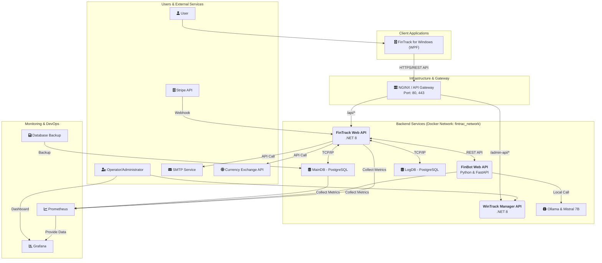
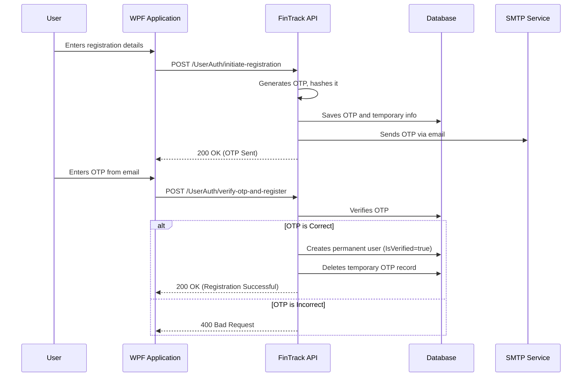
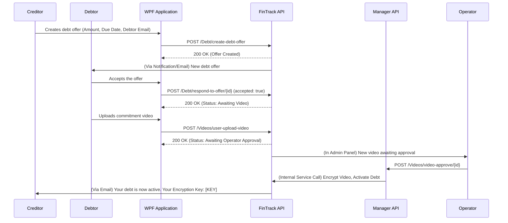
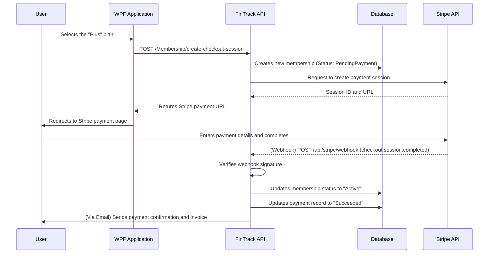

# **FinTrack Project: System Architecture and Technical Documentation**

This document provides a detailed explanation of the FinTrack platform's technical architecture, its core components, technologies, data flows, and the interactions between them.

## 1. Overview and Architectural Approach

FinTrack is built on a **containerized** and **microservices-oriented** architecture. The system consists of independent services managed using Docker and Docker Compose, which communicate with each other via APIs. This approach provides the following advantages:
*   **Scalability:** Each service can be scaled independently as needed.
*   **Flexibility:** Each service can be developed with the technology stack best suited for its task (e.g., using .NET and Python together).
*   **Maintainability:** Changes in one service do not directly affect others.
*   **Ease of Deployment:** The entire infrastructure can be launched with a single command using Docker.

## 2. High-Level Architecture Diagram

The following diagram illustrates the main components of the system, the primary data flow between them, and their interaction with the outside world.

```mermaid
graph TD
    subgraph "Users & External Services"
        User["fa:fa-user User"]
        Admin["fa:fa-user-shield Operator/Administrator"]
        StripeSvc["fa:fa-stripe Stripe API"]
        EmailSvc["fa:fa-envelope SMTP Service"]
        CurrencyApi["fa:fa-globe Currency Exchange API"]
    end

    subgraph "Client Applications"
        WPF_Client["fa:fa-windows FinTrack for Windows (WPF)"]
    end

    subgraph "Infrastructure & Gateway"
        Nginx["fa:fa-server NGINX / API Gateway<br>Port: 80, 443"]
    end

    subgraph "Backend Services (Docker Network: fintrac_network)"
        API_Main(<b>FinTrack Web API</b><br>.NET 8)
        API_Admin(<b>WinTrack Manager API</b><br>.NET 8)
        API_Bot(<b>FinBot Web API</b><br>Python & FastAPI)
        DB_Main["fa:fa-database MainDB - PostgreSQL"]
        DB_Log["fa:fa-database LogDB - PostgreSQL"]
        Ollama["fa:fa-brain Ollama & Mistral 7B"]
    end
    
    subgraph "Monitoring & DevOps"
        Prometheus["fa:fa-chart-line Prometheus"]
        Grafana["fa:fa-chart-bar Grafana"]
        PgBackup["fa:fa-save Database Backup"]
    end

    User --> WPF_Client
    Admin --> API_Admin

    WPF_Client --> |HTTPS/REST API| Nginx
    
    Nginx --> |/api/*| API_Main
    Nginx --> |/admin-api/*| API_Admin

    API_Main <--> |REST API| API_Bot
    API_Main <--> |TCP/IP| DB_Main
    API_Main <--> |TCP/IP| DB_Log
    API_Main --> |API Call| EmailSvc
    API_Main --> |API Call| CurrencyApi
    API_Bot --> |Local Call| Ollama

    StripeSvc --> |Webhook| API_Main

    API_Main -- "Collect Metrics" --> Prometheus
    API_Bot -- "Collect Metrics" --> Prometheus
    DB_Main -- "Collect Metrics" --> Prometheus
    
    Prometheus --> |Provide Data| Grafana
    Admin --> |Dashboard| Grafana
    
    PgBackup --> |Backup| DB_Main
```

## 3. Core Components

### 3.1. Main Backend Services

*   **FinTrack Web API (`fintrack_api`):**
    *   **Technology:** .NET 8, ASP.NET Core, Entity Framework Core.
    *   **Responsibilities:** This is the core engine of the system. It handles all primary functions, including user authorization (OTP, JWT), account/budget/transaction management, reporting, Secure Debt System (GBS) business logic, initiating Stripe payment sessions, and listening for webhooks.
*   **FinBot Web API (`finbot_api`):**
    *   **Technology:** Python, FastAPI.
    *   **Responsibilities:** Manages artificial intelligence operations. It receives user queries from the `FinTrack Web API`, forwards them to the Mistral 7B language model via the `Ollama` service, and returns meaningful responses.
*   **WinTrack Manager Panel (`wintrack_manager`):**
    *   **Technology:** .NET 8, ASP.NET Core.
    *   **Responsibilities:** An API designed for administrators and operators. It contains administrative functions such as video approval/rejection processes in the GBS, user management, and monitoring of system-wide data.

### 3.2. Database Architecture

*   **MainDB (`postgres_db`):**
    *   **Technology:** PostgreSQL 15.
    *   **Responsibilities:** Persistently stores the main application data (users, accounts, memberships, debts, etc.).
*   **LogDB (`postgres_db_logs`):**
    *   **Technology:** PostgreSQL 15.
    *   **Responsibilities:** Used for auditing purposes. Every data modification (Create, Update, Delete) on `MainDB` is recorded in this database with information on who made the change, when it was made, and what data was altered. This ensures full traceability while preserving the performance of the main database.

### 3.3. Client Application

*   **FinTrack for Windows (`WPF`):**
    *   **Technology:** .NET, WPF, LiveCharts2.
    *   **Responsibilities:** Provides a rich, native desktop experience for Windows users. It captures user interactions and translates them into secure RESTful API calls to the `FinTrack Web API`.

### 3.4. DevOps and Monitoring

*   **Docker & Docker Compose:** Containerizes and manages the entire infrastructure.
*   **Prometheus:** Collects real-time performance metrics from all services in the system (APIs, databases, containers).
*   **Grafana:** Visualizes the metrics from Prometheus in interactive dashboards, allowing administrators to see the overall health of the system (CPU, RAM, API response times) at a glance.
*   **Database Backup (`postgres_backup`):** Automatically backs up `MainDB` on a regular nightly schedule.

## 4. Security Architecture

*   **Authentication:**
    *   **Registration:** An **OTP (One-Time Password)** system is used to verify email ownership.
    *   **Login:** Successfully logged-in users are issued a short-lived **JWT (JSON Web Token)** containing their roles and permissions.
*   **Authorization:** API endpoints are protected with attributes like `[Authorize(Roles = "User,Admin")]`. The validity and role of the JWT are checked for every incoming request.
*   **Webhook Security:** A **Signature Verification** mechanism is used to confirm that webhook requests from Stripe genuinely originate from Stripe.
*   **GBS Cryptography:** Video evidence in the Secure Debt System is encrypted using the **AES** algorithm with a unique key generated for each video. The key is delivered only to the creditor and is not stored in the system.

## 5. Detailed Process Flows (Sequence Diagrams)

<b>Flow 1: New User Registration (Two-Factor OTP)</b>

```mermaid
sequenceDiagram
    participant User
    participant ClientApp as WPF Application
    participant API as FinTrack API
    participant DB as Database
    participant Email as SMTP Service

    User->>ClientApp: Enters registration details
    ClientApp->>API: POST /UserAuth/initiate-registration
    API->>API: Generates OTP, hashes it
    API->>DB: Saves OTP and temporary info
    API->>Email: Sends OTP via email
    API-->>ClientApp: 200 OK (OTP Sent)

    User->>ClientApp: Enters OTP from email
    ClientApp->>API: POST /UserAuth/verify-otp-and-register
    API->>DB: Verifies OTP
    alt OTP is Correct
        API->>DB: Creates permanent user (IsVerified=true)
        API->>DB: Deletes temporary OTP record
        API-->>ClientApp: 200 OK (Registration Successful)
    else OTP is Incorrect
        API-->>ClientApp: 400 Bad Request
    end
```

<b>Flow 2: Secure Debt System (GBS) Initiation</b>

```mermaid
sequenceDiagram
    participant Lender as Creditor
    participant Borrower as Debtor
    participant ClientApp as WPF Application
    participant API as FinTrack API
    participant AdminAPI as Manager API
    participant Operator

    Lender->>ClientApp: Creates debt offer (Amount, Due Date, Debtor Email)
    ClientApp->>API: POST /Debt/create-debt-offer
    API-->>ClientApp: 200 OK (Offer Created)
    API->>Borrower: (Via Notification/Email) New debt offer

    Borrower->>ClientApp: Accepts the offer
    ClientApp->>API: POST /Debt/respond-to-offer/{id} (accepted: true)
    API-->>ClientApp: 200 OK (Status: Awaiting Video)

    Borrower->>ClientApp: Uploads commitment video
    ClientApp->>API: POST /Videos/user-upload-video
    API-->>ClientApp: 200 OK (Status: Awaiting Operator Approval)
    
    API->>Operator: (In Admin Panel) New video awaiting approval
    Operator->>AdminAPI: POST /Videos/video-approve/{id}
    AdminAPI->>API: (Internal Service Call) Encrypt Video, Activate Debt
    API->>Lender: (Via Email) Your debt is now active. Your Encryption Key: [KEY]
```

<b>Flow 3: Purchasing a Membership (Stripe)</b>

```mermaid
sequenceDiagram
    participant User
    participant ClientApp as WPF Application
    participant API as FinTrack API
    participant DB as Database
    participant Stripe as Stripe API

    User->>ClientApp: Selects the "Plus" plan
    ClientApp->>API: POST /Membership/create-checkout-session
    API->>DB: Creates new membership (Status: PendingPayment)
    API->>Stripe: Request to create payment session
    Stripe-->>API: Session ID and URL
    API-->>ClientApp: Returns Stripe payment URL

    ClientApp->>User: Redirects to Stripe payment page
    User->>Stripe: Enters payment details and completes
    
    Stripe-->>API: (Webhook) POST /api/stripe/webhook (checkout.session.completed)
    API->>API: Verifies webhook signature
    API->>DB: Updates membership status to "Active"
    API->>DB: Updates payment record to "Succeeded"
    API->>User: (Via Email) Sends payment confirmation and invoice
```

