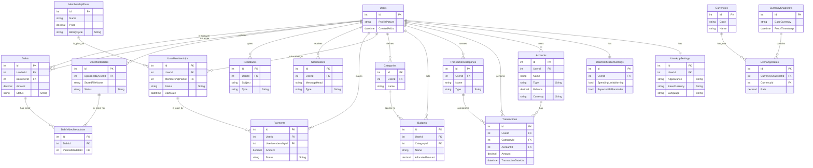

# **FinTrack API - Comprehensive Database Schema Documentation**

This document provides a detailed explanation of the structure, tables, fields, and relationships of the PostgreSQL database used in the FinTrack API project, based entirely on the **Entity Framework Core configuration in `MyDataContext.cs`**.

## 1. Overview

The FinTrack API's database is designed to store users' financial data, settings, memberships, and other critical system-related information. The database system used is **PostgreSQL 15**. The schema has been developed using the EF Core Code-First approach, focusing on normalization principles, data integrity, and performance.

## 2. Entity-Relationship Diagram (ERD)

The following diagram visualizes the primary relationships between the database tables.

```mermaid
erDiagram
    Users {
        int Id PK
        string ProfilePicture
        datetime CreatedAtUtc
    }
    UserAppSettings {
        int Id PK
        int UserId FK
        string Appearance "String"
        string BaseCurrency "String"
        string Language "String"
    }
    UserNotificationSettings {
        int Id PK
        int UserId FK
        bool SpendingLimitWarning
        bool ExpectedBillReminder
    }
    Accounts {
        int Id PK
        int UserId FK
        string Name
        string Type "String"
        decimal Balance
        string Currency "String"
    }
    Transactions {
        int Id PK
        int UserId FK
        int CategoryId FK
        int AccountId FK
        decimal Amount
        datetime TransactionDateUtc
    }
    TransactionCategories {
        int Id PK
        int UserId FK
        string Name
        string Type "String"
    }
    Budgets {
        int Id PK
        int UserId FK
        int CategoryId FK
        string Name
        decimal AllocatedAmount
    }
    Categories {
        int Id PK
        int UserId FK
        string Name
    }
    MembershipPlans {
        int Id PK
        string Name
        decimal Price
        string BillingCycle "String"
    }
    UserMemberships {
        int Id PK
        int UserId FK
        int MembershipPlanId FK
        string Status "String"
        datetime StartDate
    }
    Payments {
        int Id PK
        int UserId FK
        int UserMembershipId FK
        decimal Amount
        string Status "String"
    }
    Debts {
        int Id PK
        int LenderId FK
        int BorrowerId FK
        decimal Amount
        string Status "String"
    }
    VideoMetadatas {
        int Id PK
        int UploadedByUserId FK
        string StoredFileName
        string Status "String"
    }
    DebtVideoMetadatas {
        int Id PK
        int DebtId FK
        int VideoMetadataId FK
    }
    Currencies {
        int Id PK
        string Code
        string Name
    }
    CurrencySnapshots {
        int Id PK
        string BaseCurrency
        datetime FetchTimestamp
    }
    ExchangeRates {
        int Id PK
        int CurrencySnapshotId FK
        int CurrencyId FK
        decimal Rate
    }
    Notifications {
        int Id PK
        int UserId FK
        string MessageHead
        string Type "String"
    }
    Feedbacks {
        int Id PK
        int UserId FK
        string Subject
        string Type "String"
    }
    Users ||--|| UserAppSettings : "has"
    Users ||--|| UserNotificationSettings : "has"
    Users ||--o{ Accounts : "owns"
    Users ||--o{ Transactions : "performs"
    Users ||--o{ TransactionCategories : "creates"
    Users ||--o{ Budgets : "sets"
    Users ||--o{ Categories : "defines"
    Users ||--o{ UserMemberships : "subscribes_to"
    Users ||--o{ Payments : "makes"
    Users ||--o{ Notifications : "receives"
    Users ||--o{ Feedbacks : "gives"
    Users ||--o{ VideoMetadatas : "uploads"
    Users ||--o{ Debts : "is Lender"
    Users ||--o{ Debts : "is Borrower"
    Accounts ||--o{ Transactions : "has"
    TransactionCategories ||--o{ Transactions : "categorizes"
    Categories ||--o{ Budgets : "applies_to"
    MembershipPlans ||--o{ UserMemberships : "is_plan_for"
    UserMemberships ||--o{ Payments : "is_paid_by"
    Debts ||--o{ DebtVideoMetadatas : "has_proof"
    VideoMetadatas ||--|{ DebtVideoMetadatas : "is_proof_for"
    CurrencySnapshots ||--o{ ExchangeRates : "contains"
    Currencies ||--o{ ExchangeRates : "has_rate"
```

## 3. Table Details

---

### Users (Identity)
Derived from ASP.NET Core Identity, this is the central table that stores users' basic information and authentication details.

| Column Name | Data Type | Constraints/Notes |
| :--- | :--- | :--- |
| `Id` | INT | PK, Auto-Increment |
| `UserName` | STRING | Unique, Required |
| ... | ... | Other standard Identity columns (`NormalizedUserName`, `Email`, `PasswordHash`, etc.) |
| `ProfilePicture` | STRING | Nullable, Max 255 chars, Has a default image URL. |
| `CreatedAtUtc` | TIMESTAMP | Required, Record creation time, Default: `NOW()` |

**Relationships:**
*   One-to-One with `UserAppSettings` (Cascade), `UserNotificationSettings` (Cascade).
*   One-to-Many with `Accounts` (Cascade), `Budgets` (Cascade), `Categories` (Cascade), `Transactions` (Cascade), `UserMemberships` (Cascade), `Notifications` (Cascade), `Debts` (Cascade), `UploadedVideos` (Cascade), `Feedbacks` (Cascade).
*   One-to-Many with `Payments` (**NoAction**).

---

### UserAppSettings
Stores the user's personal in-app settings (theme, language, currency).

| Column Name | Data Type | Constraints/Notes |
| :--- | :--- | :--- |
| `Id` | INT | PK, Auto-Increment |
| `UserId` | INT | FK (Users.Id), Unique Index, Required |
| `Appearance` | STRING | Stored as text, Default: `Dark` |
| `BaseCurrency`| STRING | Stored as text, Default: `TRY` |
| `Language` | STRING | Stored as text, Default: `en_US` |
| `CreatedAtUtc`| TIMESTAMP | Required, Default: `NOW()` |
| `UpdatedAtUtc`| TIMESTAMP | Nullable. |

---

### UserNotificationSettings
Manages the user's notification preferences.

| Column Name | Data Type | Constraints/Notes |
| :--- | :--- | :--- |
| `Id` | INT | PK, Auto-Increment |
| `UserId` | INT | FK (Users.Id), Unique, Required |
| `SpendingLimitWarning`| BOOLEAN | Default: `true` |
| `ExpectedBillReminder`| BOOLEAN | Default: `true` |
| ... | BOOLEAN | All other notification settings, Default: `true` |
| `CreatedAtUtc`| TIMESTAMP | Required, Default: `NOW()` |
| `UpdatedAtUtc`| TIMESTAMP | Nullable. |

---

### OtpVerifications
Temporarily stores one-time password (OTP) information for user email verification.

| Column Name | Data Type | Constraints/Notes |
| :--- | :--- | :--- |
| `Id` | INT | PK, Auto-Increment |
| `Email` | STRING | Required, Max 255, Indexed. |
| `OtpCode` | STRING | Required, Max 255, **Hashed** OTP code. |
| `CreateAt` | TIMESTAMP | Required, Default: `NOW()`. |
| `ExpireAt`| TIMESTAMP | Required, Default: `NOW() + 5 minutes`. |
| `Username`| STRING | Required, Max 100, Temporary username for new registration. |
| `TemporaryPlainPassword` | STRING | Required, Max 255, Temporary password for new registration (deleted after verification). |

---

### Accounts
Represents users' financial assets (bank account, cash, etc.).

| Column Name | Data Type | Constraints/Notes |
| :--- | :--- | :--- |
| `Id` | INT | PK |
| `UserId` | INT | FK (Users.Id), Required |
| `AccountName` | STRING | Required, Max 100. |
| `AccountType` | STRING | Text, Default: `Cash`. |
| `IsActive` | BOOLEAN | Default: `true`. |
| `Balance` | DECIMAL(18,2) | Required. |
| `Currency`| STRING | Text, Default: `TRY`. |
| `CreatedAtUtc`| TIMESTAMP | Default: `NOW()`. |
| `UpdatedAtUtc`| TIMESTAMP | Nullable. |
| **Index:** Unique index on `UserId` and `AccountName`. |
| **Relationships:** Cannot be deleted if it has related `Transactions` (`OnDelete: Restrict`). |

---

### Transactions
Records users' income and expense transactions.

| Column Name | Data Type | Constraints/Notes |
| :--- | :--- | :--- |
| `Id` | INT | PK |
| `UserId` | INT | FK (Users.Id) |
| `AccountId` | INT | FK (Accounts.Id) |
| `CategoryId`| INT | FK (TransactionCategories.Id) |
| `Amount` | DECIMAL(18,2) | Required. |
| `TransactionDateUtc`| TIMESTAMP| Required. |
| **Relationships:** Delete behavior is set to `Restrict`. A related User, Account, or Category cannot be deleted. |

---

### TransactionCategories
Used to classify transactions (e.g., `Salary`, `Bills`).

| Column Name | Data Type | Constraints/Notes |
| :--- | :--- | :--- |
| `Id` | INT | PK |
| `UserId` | INT | FK (Users.Id), Required |
| `CategoryName`| STRING | Required, Max 100. |
| `CategoryType`| STRING | Text, Required. |
| **Index:** Unique index on `UserId` and `CategoryName`. |
| **Relationships:** Cannot be deleted if it has related `Transactions` (`OnDelete: Restrict`). |

---

### Categories
Used to classify budgets.

| Column Name | Data Type | Constraints/Notes |
| :--- | :--- | :--- |
| `Id` | INT | PK |
| `UserId` | INT | FK (Users.Id), Required |
| `CategoryName`| STRING | Required, Max 100. |
| **Index:** Unique index on `UserId` and `CategoryName`. |
| **Relationships:** Cannot be deleted if it has related `Budgets` (`OnDelete: Restrict`). |

---

### Budgets
Allows users to define budget goals for specific categories.

| Column Name | Data Type | Constraints/Notes |
| :--- | :--- | :--- |
| `Id` | INT | PK |
| `UserId` | INT | FK (Users.Id) |
| `CategoryId`| INT | FK (Categories.Id) |
| `BudgetName`| STRING | Required, Max 100. |
| `AllocatedAmount`| DECIMAL(18,2)| Required. |
| `ReachedAmount`| DECIMAL(18,2)| Nullable. |
| `StartDate` | DATE | Required. |
| `EndDate` | DATE | Required. |

---

### MembershipPlans
Defines the different membership plans offered by the application (Free, Plus, Pro) and their features.

| Column Name | Data Type | Constraints/Notes |
| :--- | :--- | :--- |
| `Id` | INT | PK |
| `PlanName` | STRING | Required, Unique, Max 100. |
| `Price` | DECIMAL(18,2)| Required. |
| `BillingCycle`| STRING | Text, Default: `Monthly`. |
| `DurationInDays`| INT | Nullable. |
| `PrioritySupport`| BOOLEAN | Default: `false`. |

**Owned Types:**
This table uses "Owned Entity Types" to store the plan's features.
*   **Reporting:** Contains columns like `ReportingLevel`, `CanExportPdf`, `CanExportWord`.
*   **Emailing:** Contains columns like `CanEmailReports`, `MaxEmailsPerMonth`.
*   **Budgeting:** Contains columns like `CanCreateBudgets`, `MaxBudgets`.
*   **Accounts:** Contains columns like `MaxBankAccounts`.

---

### UserMemberships
Tracks which plan a user is subscribed to, when they subscribed, and their membership status.

| Column Name | Data Type | Constraints/Notes |
| :--- | :--- | :--- |
| `Id` | INT | PK |
| `UserId` | INT | FK (Users.Id) |
| `MembershipPlanId`| INT | FK (MembershipPlans.Id) |
| `Status` | STRING | Text, Default: `PendingPayment`. |
| `AutoRenew`| BOOLEAN | Default: `false`. |
| `CancellationDate`| TIMESTAMP | Nullable. |
| **Relationships:** If a `UserMembership` is deleted, the `UserMembershipId` field of its related `Payments` becomes `NULL` (`OnDelete: SetNull`). |

---

### Payments
Records payments made via Stripe.

| Column Name | Data Type | Constraints/Notes |
| :--- | :--- | :--- |
| `Id` | INT | PK |
| `UserId` | INT | FK (Users.Id) |
| `UserMembershipId`| INT | FK (UserMemberships.Id), Nullable. |
| `TransactionId`| STRING | Stripe's transaction ID. Unique if not null. |
| `Status` | STRING | Text, Default: `Pending`. |

---

### Debts
Tracks debts between users.

| Column Name | Data Type | Constraints/Notes |
| :--- | :--- | :--- |
| `Id` | INT | PK |
| `LenderId` | INT | FK (Users.Id), The creditor. |
| `BorrowerId`| INT | FK (Users.Id), The debtor. |
| `Amount` | DECIMAL(18,2)| Required. |
| `DueDateUtc`| DATE | Required. |
| `Status` | STRING | Text, Default: `PendingBorrowerAcceptance`. |

---

### VideoMetadatas & DebtVideoMetadatas
Manages the metadata of videos uploaded for GBS and their relationship with debts.

| Column Name (`VideoMetadatas`) | Data Type | Constraints/Notes |
| :--- | :--- | :--- |
| `Id` | INT | PK |
| `UploadedByUserId` | INT | FK (Users.Id) |
| `StoredFileName`| STRING | Required, Max 255. |
| `UnencryptedFilePath`| STRING | Nullable, Temporary file path. |
| `EncryptedFilePath`| STRING | Nullable, Encrypted file path. |
| `EncryptionKeyHash`| STRING | Nullable, Hash of the key. |
| `Status` | STRING | Text, Default: `PendingApproval`. |
| **Relationships:** One-to-Many with `DebtVideoMetadatas` (Cascade). If a video metadata is deleted, all its links to debts are also deleted. |

---

### Currencies
Defines the currency units and metadata available in the system.

| Column Name | Data Type | Constraints/Notes |
| :--- | :--- | :--- |
| `Id` | INT | PK |
| `Code` | STRING(20) | Unique, Required. E.g., "USD". |
| `Name` | STRING(100) | Required. E.g., "United States Dollar". |
| `CountryCode` | STRING(20) | Optional. |
| `Status` | STRING(20) | Required. |
| `IconUrl` | STRING(255) | Optional, Has a default value. |
| `LastUpdatedUtc`| DATETIME | Required, Default: `NOW()`. |

---

### CurrencySnapshots
Stores a snapshot of exchange rates at a specific point in time.

| Column Name | Data Type | Constraints/Notes |
| :--- | :--- | :--- |
| `Id` | INT | PK |
| `BaseCurrency` | STRING(20) | Required. Specifies the base currency for the rates. |
| `HasChanges` | BOOLEAN | Required, Default: `false`. |
| `FetchTimestamp`| DATETIME | Required, Default: `NOW()`. The time the rates were fetched. |

---

### ExchangeRates
Stores the rate of each currency within a `CurrencySnapshot`.

| Column Name | Data Type | Constraints/Notes |
| :--- | :--- | :--- |
| `Id` | INT | PK |
| `CurrencySnapshotId` | INT | FK (CurrencySnapshots.Id), Required. |
| `CurrencyId` | INT | FK (Currencies.Id), Required. |
| `Rate` | DECIMAL(18,6) | Required. The exchange rate value. |

---

### Notifications
Stores notifications to be displayed to users.

| Column Name | Data Type | Constraints/Notes |
| :--- | :--- | :--- |
| `Id` | INT | PK |
| `UserId` | INT | FK (Users.Id), Required. |
| `MessageHead`| STRING(200) | Required. Notification title. |
| `MessageBody`| STRING(1000)| Required. Notification content. |
| `Type` | STRING(50) | Required, Default: `Info`. |
| `IsRead` | BOOLEAN | Required, Default: `false`. |
| `CreatedAtUtc`| DATETIME | Required, Default: `NOW()`. |
| `ReadAtUtc` | DATETIME | Optional. The time it was read. |

---

### Feedbacks
Stores feedback submitted by users.

| Column Name | Data Type | Constraints/Notes |
| :--- | :--- | :--- |
| `Id` | INT | PK |
| `UserId` | INT | FK (Users.Id), Required. |
| `Subject` | STRING(255) | Required. Feedback subject. |
| `Description`| STRING(500) | Required. Feedback description. |
| `Type` | STRING | Required, Default: `GeneralFeedback`. |
| `SavedFilePath`| STRING(500)| Optional. Path to an attached file, if any. |
| `CreatedAtUtc`| DATETIME | Required, Default: `NOW()`. |

## 4. Design Principles and Rules

*   **Single Source of Truth:** This document is generated based on the EF Core configurations in the `MyDataContext.cs` file.
*   **Naming Convention:** PascalCase is used for tables and columns.
*   **UTC Timestamps:** All date/time fields are stored in UTC format (`timestamp with time zone`), and their names are suffixed with `...Utc`.
*   **Enums as Strings:** Fields like `Type` and `Status` are stored as `string` in the database (`HasConversion<string>()`) to enhance readability.
*   **Automatic Audit Logging:** The `SaveChangesAsync` method is overridden. Every `Create`, `Update`, and `Delete` operation performed via `MyDataContext` is automatically logged to the `AuditLogs` table in `LogDataContext`. This log stores who (`UserId`), when, in which table, and with what data (in JSON format) the operation was performed.
*   **Delete Behaviors (OnDelete):** To maintain relational integrity, delete behaviors are carefully configured: `Cascade`, `Restrict`, `SetNull`, `NoAction`.
*   **Owned Types:** Used in tables like `MembershipPlans` to group logically related fields and keep the schema cleaner.