# FinTrack API - Kapsamlı Veritabanı Şeması Dokümanı

Bu doküman, FinTrack API projesinde kullanılan PostgreSQL veritabanının yapısını, tablolarını, alanlarını ve aralarındaki ilişkileri **Entity Framework Core yapılandırmasına (`MyDataContext.cs`) dayanarak** en ince detayına kadar açıklamaktadır.

## 1. Genel Bakış

FinTrack API'nin veritabanı, kullanıcıların finansal verilerini, ayarlarını, üyeliklerini ve sistemle ilgili diğer kritik bilgileri depolamak üzere tasarlanmıştır. Veritabanı sistemi olarak **PostgreSQL 15** kullanılmaktadır. Şema, normalizasyon prensiplerine, veri bütünlüğüne ve performansa odaklanarak EF Core Code-First yaklaşımı ile geliştirilmiştir.

## 2. Veritabanı İlişki Diyagramı (ERD)

Aşağıdaki diyagram, veritabanı tabloları arasındaki temel ilişkileri görselleştirmektedir.

```mermaid
erDiagram
    Users {
        int Id PK
        string ProfilePicture
        datetime CreatedAtUtc
    }
    UserAppSettings {
        int Id PK
        int UserId FK
        string Appearance "Metin"
        string BaseCurrency "Metin"
        string Language "Metin"
    }
    UserNotificationSettings {
        int Id PK
        int UserId FK
        bool SpendingLimitWarning
        bool ExpectedBillReminder
    }
    Accounts {
        int Id PK
        int UserId FK
        string Name
        string Type "Metin"
        decimal Balance
        string Currency "Metin"
    }
    Transactions {
        int Id PK
        int UserId FK
        int CategoryId FK
        int AccountId FK
        decimal Amount
        datetime TransactionDateUtc
    }
    TransactionCategories {
        int Id PK
        int UserId FK
        string Name
        string Type "Metin"
    }
    Budgets {
        int Id PK
        int UserId FK
        int CategoryId FK
        string Name
        decimal AllocatedAmount
    }
    Categories {
        int Id PK
        int UserId FK
        string Name
    }
    MembershipPlans {
        int Id PK
        string Name
        decimal Price
        string BillingCycle "Metin"
    }
    UserMemberships {
        int Id PK
        int UserId FK
        int MembershipPlanId FK
        string Status "Metin"
        datetime StartDate
    }
    Payments {
        int Id PK
        int UserId FK
        int UserMembershipId FK
        decimal Amount
        string Status "Metin"
    }
    Debts {
        int Id PK
        int LenderId FK
        int BorrowerId FK
        decimal Amount
        string Status "Metin"
    }
    VideoMetadatas {
        int Id PK
        int UploadedByUserId FK
        string StoredFileName
        string Status "Metin"
    }
    DebtVideoMetadatas {
        int Id PK
        int DebtId FK
        int VideoMetadataId FK
    }
    Currencies {
        int Id PK
        string Code
        string Name
    }
    CurrencySnapshots {
        int Id PK
        string BaseCurrency
        datetime FetchTimestamp
    }
    ExchangeRates {
        int Id PK
        int CurrencySnapshotId FK
        int CurrencyId FK
        decimal Rate
    }
    Notifications {
        int Id PK
        int UserId FK
        string MessageHead
        string Type "Metin"
    }
    Feedbacks {
        int Id PK
        int UserId FK
        string Subject
        string Type "Metin"
    }
    Users ||--|| UserAppSettings : "has"
    Users ||--|| UserNotificationSettings : "has"
    Users ||--o{ Accounts : "owns"
    Users ||--o{ Transactions : "performs"
    Users ||--o{ TransactionCategories : "creates"
    Users ||--o{ Budgets : "sets"
    Users ||--o{ Categories : "defines"
    Users ||--o{ UserMemberships : "subscribes_to"
    Users ||--o{ Payments : "makes"
    Users ||--o{ Notifications : "receives"
    Users ||--o{ Feedbacks : "gives"
    Users ||--o{ VideoMetadatas : "uploads"
    Users ||--o{ Debts : "is Lender"
    Users ||--o{ Debts : "is Borrower"
    Accounts ||--o{ Transactions : "has"
    TransactionCategories ||--o{ Transactions : "categorizes"
    Categories ||--o{ Budgets : "applies_to"
    MembershipPlans ||--o{ UserMemberships : "is_plan_for"
    UserMemberships ||--o{ Payments : "is_paid_by"
    Debts ||--o{ DebtVideoMetadatas : "has_proof"
    VideoMetadatas ||--|{ DebtVideoMetadatas : "is_proof_for"
    CurrencySnapshots ||--o{ ExchangeRates : "contains"
    Currencies ||--o{ ExchangeRates : "has_rate"
```

*(Not: `Employees`, `Departments` gibi iç tablolar, ana kullanıcı akışından ayrı olduğu için diyagramda gösterilmemiştir.)*

## 3. Tablo Detayları

---

### Users (Identity)
ASP.NET Core Identity'den türeyen, kullanıcıların temel bilgilerini ve kimlik doğrulama detaylarını saklayan merkezi tablodur.

| Kolon Adı | Veri Tipi | Kısıtlamalar/Notlar |
| :--- | :--- | :--- |
| `Id` | INT | PK, Otomatik Artan |
| `UserName` | STRING | Benzersiz, Zorunlu |
| ... | ... | Diğer standart Identity kolonları (`NormalizedUserName`, `Email`, `PasswordHash` vb.) |
| `ProfilePicture` | STRING | NULL olabilir, Maks. 255 karakter, Varsayılan resim URL'si var. |
| `CreatedAtUtc` | TIMESTAMP | Zorunlu, Kayıt oluşturulma zamanı, Varsayılan: `NOW()` |

**İlişkiler:**
*   `UserAppSettings` (1-1, Cascade), `UserNotificationSettings` (1-1, Cascade), `Accounts` (1-N, Cascade), `Budgets` (1-N, Cascade), `Categories` (1-N, Cascade), `Transactions` (1-N, Cascade), `UserMemberships` (1-N, Cascade), `Notifications` (1-N, Cascade), `Debts` (1-N, Cascade), `UploadedVideos` (1-N, Cascade), `Feedbacks` (1-N, Cascade).
*   `Payments` (1-N, **NoAction**).

---

### UserAppSettings
Kullanıcının uygulama içi kişisel ayarlarını (tema, dil, para birimi) saklar.

| Kolon Adı | Veri Tipi | Kısıtlamalar/Notlar |
| :--- | :--- | :--- |
| `Id` | INT | PK, Otomatik Artan |
| `UserId` | INT | FK (Users.Id), Benzersiz (Unique Index), Zorunlu |
| `Appearance` | STRING | Metin olarak saklanır, Varsayılan: `Dark` |
| `BaseCurrency`| STRING | Metin olarak saklanır, Varsayılan: `TRY` |
| `Language` | STRING | Metin olarak saklanır, Varsayılan: `tr_TR` |
| `CreatedAtUtc`| TIMESTAMP | Zorunlu, Varsayılan: `NOW()` |
| `UpdatedAtUtc`| TIMESTAMP | NULL olabilir. |

---

### UserNotificationSettings
Kullanıcının bildirim tercihlerini yönetir.

| Kolon Adı | Veri Tipi | Kısıtlamalar/Notlar |
| :--- | :--- | :--- |
| `Id` | INT | PK, Otomatik Artan |
| `UserId` | INT | FK (Users.Id), Benzersiz, Zorunlu |
| `SpendingLimitWarning`| BOOLEAN | Varsayılan: `true` |
| `ExpectedBillReminder`| BOOLEAN | Varsayılan: `true` |
| ... | BOOLEAN | Diğer tüm bildirim ayarları, Varsayılan: `true` |
| `CreatedAtUtc`| TIMESTAMP | Zorunlu, Varsayılan: `NOW()` |
| `UpdatedAtUtc`| TIMESTAMP | NULL olabilir. |

---

### OtpVerifications
Kullanıcı e-posta doğrulaması için tek kullanımlık şifre (OTP) bilgilerini geçici olarak saklar.

| Kolon Adı | Veri Tipi | Kısıtlamalar/Notlar |
| :--- | :--- | :--- |
| `Id` | INT | PK, Otomatik Artan |
| `Email` | STRING | Zorunlu, Maks. 255, İndeksli. |
| `OtpCode` | STRING | Zorunlu, Maks. 255, **Hash'lenmiş** OTP kodu. |
| `CreateAt` | TIMESTAMP | Zorunlu, Varsayılan: `NOW()`. |
| `ExpireAt`| TIMESTAMP | Zorunlu, Varsayılan: `NOW() + 5 dakika`. |
| `Username`| STRING | Zorunlu, Maks. 100, Yeni kayıt için geçici kullanıcı adı. |
| `TemporaryPlainPassword` | STRING | Zorunlu, Maks. 255, Yeni kayıt için geçici şifre (doğrulama sonrası silinir). |

---

### Accounts
Kullanıcıların finansal varlıklarını (banka hesabı, nakit vb.) temsil eder.

| Kolon Adı | Veri Tipi | Kısıtlamalar/Notlar |
| :--- | :--- | :--- |
| `Id` | INT | PK |
| `UserId` | INT | FK (Users.Id), Zorunlu |
| `AccountName` | STRING | Zorunlu, Maks. 100. |
| `AccountType` | STRING | Metin, Varsayılan: `Cash`. |
| `IsActive` | BOOLEAN | Varsayılan: `true`. |
| `Balance` | DECIMAL(18,2) | Zorunlu. |
| `Currency`| STRING | Metin, Varsayılan: `TRY`. |
| `CreatedAtUtc`| TIMESTAMP | Varsayılan: `NOW()`. |
| `UpdatedAtUtc`| TIMESTAMP | NULL olabilir. |
| **İndeks:** `UserId` ve `AccountName` üzerinde benzersiz (unique) indeks bulunur. |
| **İlişkiler:** Kendisine bağlı `Transactions` kayıtları varsa silinemez (`OnDelete: Restrict`). |

---

### Transactions
Kullanıcıların gelir ve gider işlemlerini kaydeder.

| Kolon Adı | Veri Tipi | Kısıtlamalar/Notlar |
| :--- | :--- | :--- |
| `Id` | INT | PK |
| `UserId` | INT | FK (Users.Id) |
| `AccountId` | INT | FK (Accounts.Id) |
| `CategoryId`| INT | FK (TransactionCategories.Id) |
| `Amount` | DECIMAL(18,2) | Zorunlu. |
| `TransactionDateUtc`| TIMESTAMP| Zorunlu. |
| **İlişkiler:** Silme davranışı `Restrict` olarak ayarlanmıştır. Yani ilişkili bir User, Account veya Category silinemez. |

---

### TransactionCategories
İşlemleri sınıflandırmak için kullanılır (`Maaş`, `Fatura` vb.).

| Kolon Adı | Veri Tipi | Kısıtlamalar/Notlar |
| :--- | :--- | :--- |
| `Id` | INT | PK |
| `UserId` | INT | FK (Users.Id), Zorunlu |
| `CategoryName`| STRING | Zorunlu, Maks. 100. |
| `CategoryType`| STRING | Metin, Zorunlu. |
| **İndeks:** `UserId` ve `CategoryName` üzerinde benzersiz (unique) indeks bulunur. |
| **İlişkiler:** Kendisine bağlı `Transactions` kayıtları varsa silinemez (`OnDelete: Restrict`). |

---

### Categories
Bütçeleri sınıflandırmak için kullanılır.

| Kolon Adı | Veri Tipi | Kısıtlamalar/Notlar |
| :--- | :--- | :--- |
| `Id` | INT | PK |
| `UserId` | INT | FK (Users.Id), Zorunlu |
| `CategoryName`| STRING | Zorunlu, Maks. 100. |
| **İndeks:** `UserId` ve `CategoryName` üzerinde benzersiz (unique) indeks bulunur. |
| **İlişkiler:** Kendisine bağlı `Budgets` kayıtları varsa silinemez (`OnDelete: Restrict`). |

---

### Budgets
Kullanıcıların belirli kategoriler için bütçe hedeflerini tanımlamasını sağlar.

| Kolon Adı | Veri Tipi | Kısıtlamalar/Notlar |
| :--- | :--- | :--- |
| `Id` | INT | PK |
| `UserId` | INT | FK (Users.Id) |
| `CategoryId`| INT | FK (Categories.Id) |
| `BudgetName`| STRING | Zorunlu, Maks. 100. |
| `AllocatedAmount`| DECIMAL(18,2)| Zorunlu. |
| `ReachedAmount`| DECIMAL(18,2)| NULL olabilir. |
| `StartDate` | DATE | Zorunlu. |
| `EndDate` | DATE | Zorunlu. |

---

### MembershipPlans
Uygulamanın sunduğu farklı üyelik planlarını (Free, Plus, Pro) ve özelliklerini tanımlar.

| Kolon Adı | Veri Tipi | Kısıtlamalar/Notlar |
| :--- | :--- | :--- |
| `Id` | INT | PK |
| `PlanName` | STRING | Zorunlu, Benzersiz, Maks. 100. |
| `Price` | DECIMAL(18,2)| Zorunlu. |
| `BillingCycle`| STRING | Metin, Varsayılan: `Monthly`. |
| `DurationInDays`| INT | NULL olabilir. |
| `PrioritySupport`| BOOLEAN | Varsayılan: `false`. |

**Gömülü Özellikler (Owned Types):**
Bu tablo, planın özelliklerini saklamak için "Owned Entity Types" kullanır.
*   **Reporting:** `ReportingLevel`, `CanExportPdf`, `CanExportWord` gibi kolonlar içerir.
*   **Emailing:** `CanEmailReports`, `MaxEmailsPerMonth` gibi kolonlar içerir.
*   **Budgeting:** `CanCreateBudgets`, `MaxBudgets` gibi kolonlar içerir.
*   **Accounts:** `MaxBankAccounts` gibi kolonlar içerir.

---

### UserMemberships
Kullanıcıların hangi plana, ne zaman abone olduğunu ve üyelik durumunu takip eder.

| Kolon Adı | Veri Tipi | Kısıtlamalar/Notlar |
| :--- | :--- | :--- |
| `Id` | INT | PK |
| `UserId` | INT | FK (Users.Id) |
| `MembershipPlanId`| INT | FK (MembershipPlans.Id) |
| `Status` | STRING | Metin, Varsayılan: `PendingPayment`. |
| `AutoRenew`| BOOLEAN | Varsayılan: `false`. |
| `CancellationDate`| TIMESTAMP | NULL olabilir. |
| **İlişkiler:** Kendisine bağlı `Payments` kayıtları varsa, bu kayıtların `UserMembershipId` alanı `NULL` olur (`OnDelete: SetNull`). |

---

### Payments
Stripe üzerinden yapılan ödemelerin kaydını tutar.

| Kolon Adı | Veri Tipi | Kısıtlamalar/Notlar |
| :--- | :--- | :--- |
| `Id` | INT | PK |
| `UserId` | INT | FK (Users.Id) |
| `UserMembershipId`| INT | FK (UserMemberships.Id), NULL olabilir. |
| `TransactionId`| STRING | Stripe'ın işlem ID'si. NULL değilse benzersizdir. |
| `Status` | STRING | Metin, Varsayılan: `Pending`. |

---

### Debts
Kullanıcıların birbirlerine olan borçlarını takip eder.

| Kolon Adı | Veri Tipi | Kısıtlamalar/Notlar |
| :--- | :--- | :--- |
| `Id` | INT | PK |
| `LenderId` | INT | FK (Users.Id), Borç veren. |
| `BorrowerId`| INT | FK (Users.Id), Borç alan. |
| `Amount` | DECIMAL(18,2)| Zorunlu. |
| `DueDateUtc`| DATE | Zorunlu. |
| `Status` | STRING | Metin, Varsayılan: `PendingBorrowerAcceptance`. |

---

### VideoMetadatas & DebtVideoMetadatas
GBS için yüklenen videoların meta verilerini ve borçlarla olan ilişkisini yönetir.

| Kolon Adı (`VideoMetadatas`) | Veri Tipi | Kısıtlamalar/Notlar |
| :--- | :--- | :--- |
| `Id` | INT | PK |
| `UploadedByUserId` | INT | FK (Users.Id) |
| `StoredFileName`| STRING | Zorunlu, Maks. 255. |
| `UnencryptedFilePath`| STRING | NULL olabilir, Geçici dosya yolu. |
| `EncryptedFilePath`| STRING | NULL olabilir, Şifreli dosya yolu. |
| `EncryptionKeyHash`| STRING | NULL olabilir, Anahtarın hash'i. |
| `Status` | STRING | Metin, Varsayılan: `PendingApproval`. |
| **İlişkiler:** `DebtVideoMetadatas` (1-N, Cascade). Bir video metadatası silinirse, borçla olan tüm bağlantıları da silinir. |

---

### Currencies
Sistemde kullanılabilen döviz birimlerini ve meta verilerini tanımlar.

| Kolon Adı | Veri Tipi | Kısıtlamalar/Notlar |
| :--- | :--- | :--- |
| `Id` | INT | PK |
| `Code` | STRING(20) | Benzersiz (Unique), Zorunlu. Örn: "USD". |
| `Name` | STRING(100) | Zorunlu. Örn: "United States Dollar". |
| `CountryCode` | STRING(20) | Opsiyonel. |
| `Status` | STRING(20) | Zorunlu. |
| `IconUrl` | STRING(255) | Opsiyonel, Varsayılan değeri var. |
| `LastUpdatedUtc`| DATETIME | Zorunlu, Varsayılan: `NOW()`. |

---

### CurrencySnapshots
Belirli bir zamanda alınan döviz kuru anlık görüntüsünü saklar.

| Kolon Adı | Veri Tipi | Kısıtlamalar/Notlar |
| :--- | :--- | :--- |
| `Id` | INT | PK |
| `BaseCurrency` | STRING(20) | Zorunlu. Kurların hangi para birimine göre alındığını belirtir. |
| `HasChanges` | BOOLEAN | Zorunlu, Varsayılan: `false`. |
| `FetchTimestamp`| DATETIME | Zorunlu, Varsayılan: `NOW()`. Kurların alınma zamanı. |

---

### ExchangeRates
Bir `CurrencySnapshot` içindeki her bir döviz biriminin oranını (kurunu) tutar.

| Kolon Adı | Veri Tipi | Kısıtlamalar/Notlar |
| :--- | :--- | :--- |
| `Id` | INT | PK |
| `CurrencySnapshotId` | INT | FK (CurrencySnapshots.Id), Zorunlu. |
| `CurrencyId` | INT | FK (Currencies.Id), Zorunlu. |
| `Rate` | DECIMAL(18,6) | Zorunlu. Döviz kuru değeri. |

---

### Notifications
Kullanıcılara gösterilecek bildirimleri saklar.

| Kolon Adı | Veri Tipi | Kısıtlamalar/Notlar |
| :--- | :--- | :--- |
| `Id` | INT | PK |
| `UserId` | INT | FK (Users.Id), Zorunlu. |
| `MessageHead`| STRING(200) | Zorunlu. Bildirim başlığı. |
| `MessageBody`| STRING(1000)| Zorunlu. Bildirim içeriği. |
| `Type` | STRING(50) | Zorunlu, Varsayılan: `Info`. |
| `IsRead` | BOOLEAN | Zorunlu, Varsayılan: `false`. |
| `CreatedAtUtc`| DATETIME | Zorunlu, Varsayılan: `NOW()`. |
| `ReadAtUtc` | DATETIME | Opsiyonel. Okunma zamanı. |

---

### Feedbacks
Kullanıcılar tarafından gönderilen geri bildirimleri saklar.

| Kolon Adı | Veri Tipi | Kısıtlamalar/Notlar |
| :--- | :--- | :--- |
| `Id` | INT | PK |
| `UserId` | INT | FK (Users.Id), Zorunlu. |
| `Subject` | STRING(255) | Zorunlu. Geri bildirim konusu. |
| `Description`| STRING(500) | Zorunlu. Geri bildirim açıklaması. |
| `Type` | STRING | Zorunlu, Varsayılan: `GeneralFeedback`. |
| `SavedFilePath`| STRING(500)| Opsiyonel. Varsa eklenen dosyanın yolu. |
| `CreatedAtUtc`| DATETIME | Zorunlu, Varsayılan: `NOW()`. |

## 4. Tasarım Prensipleri ve Kurallar

*   **Tek Doğruluk Kaynağı:** Bu doküman, `MyDataContext.cs` dosyasındaki EF Core yapılandırmaları temel alınarak oluşturulmuştur.
*   **İsimlendirme:** Tablolar ve kolonlar için PascalCase kullanılmıştır.
*   **UTC Zaman Damgaları:** Tüm tarih/saat alanları UTC (`timestamp with time zone`) formatında saklanır ve alan adları `...Utc` son eki ile belirtilir.
*   **Enum'ların Metin Olarak Saklanması:** `Type`, `Status` gibi alanlar, okunabilirliği artırmak için veritabanında `string` olarak saklanır (`HasConversion<string>()`).
*   **Otomatik Denetim Kaydı (Audit Logging):** `SaveChangesAsync` metodu override edilmiştir. `MyDataContext` üzerinden yapılan her `Ekleme`, `Güncelleme` ve `Silme` işlemi, `LogDataContext` içindeki `AuditLogs` tablosuna otomatik olarak kaydedilir. Bu log, işlemi kimin (`UserId`), ne zaman, hangi tabloda ve hangi verilerle yaptığını JSON formatında saklar.
*   **Silme Davranışları (OnDelete):** İlişkisel bütünlüğü korumak için silme davranışları dikkatlice ayarlanmıştır: `Cascade`, `Restrict`, `SetNull`, `NoAction`.
*   **Gömülü Varlıklar (Owned Types):** `MembershipPlans` tablosunda olduğu gibi, birbiriyle mantıksal olarak ilişkili alanları gruplamak ve şemayı daha temiz tutmak için kullanılmıştır.