# FinTrack API - Veritabanı Şeması Detayları

Bu doküman, FinTrack API projesinde kullanılan PostgreSQL veritabanının yapısını, tablolarını, alanlarını ve aralarındaki ilişkileri detaylı bir şekilde açıklamaktadır.

## İçindekiler

1.  [Genel Bakış](#genel-bakış)
2.  [Veritabanı İlişki Diyagramı (ERD)](#veritabanı-İlişki-diyagramı-erd)
3.  [Tablo Detayları](#tablo-detayları)
    *   [Users](#users)
    *   [UserSettings](#usersettings)
    *   [OtpVerification](#otpverification)
    *   [Accounts](#accounts)
    *   [Transactions](#transactions)
    *   [Categories](#categories)
    *   [Budgets](#budgets)
    *   [BudgetCategories](#budgetcategories)
    *   [Notifications](#notifications)
    *   [MembershipPlans](#membershipplans)
    *   [UserMemberships](#usermemberships)
    *   [Payments](#payments)
    *   [Currencies](#currencies)
    *   [CurrencySnapshots](#currencysnapshots)
    *   [ExchangeRates](#exchangerates)
    *   [Debts](#debts)
    *   [VideoMetadatas](#videometadatas)
    *   [Employees](#employees)
    *   [Departments](#departments)
    *   [EmployeeDepartments](#employeedepartments)
    *   [\_\_EFMigrationsHistory](#__efmigrationshistory)
4.  [Tasarım Prensipleri ve Kurallar](#tasarım-prensipleri-ve-kurallar)

## 1. Genel Bakış

FinTrack API'nin veritabanı, kullanıcıların finansal verilerini, ayarlarını, üyeliklerini ve sistemle ilgili diğer kritik bilgileri depolamak üzere tasarlanmıştır. Veritabanı sistemi olarak PostgreSQL 15 kullanılmaktadır. Şema, normalizasyon prensiplerine uygun olarak veri bütünlüğünü ve performansını optimize etmeyi hedefler.

## 2. Veritabanı İlişki Diyagramı (ERD)

Aşağıdaki diyagram, veritabanı tabloları arasındaki ilişkileri görselleştirmektedir.

```mermaid
erDiagram
    Users {
        int UserId PK
        string Username
        string Email
        string PasswordHash
        string ProfilePicture
        datetime CreateAt
    }

    UserSettings {
        int SettingsId PK
        int UserId FK
        string Theme
        string Language
        string Currency
        bool Notification
        datetime EntryDate
        string Notes
    }

    OtpVerification {
        int OtpId PK
        string Email
        string OtpCode
        datetime CreateAt
        datetime ExpireAt
        string Username "Temporary holder for registration"
        string PasswordHash "Temporary holder for registration"
        string ProfilePicture "Temporary holder for registration"
        int UserModelUserId FK "References Users.UserId"
    }

    Accounts {
        int AccountId PK
        int UserId FK
        string Name
        string AccountType
        bool IsActive
        decimal Balance
        datetime CreateAt
        datetime UpdateAt
    }

    Transactions {
        int TransactionId PK
        int UserId FK
        int AccountId FK
        int CategoryId FK
        decimal Amount
        datetime TransactionDate
        string Description
        datetime CreatedAt
        datetime UpdatedAt
        string Type "Income, Expense"
    }

    Categories {
        int CategoryId PK
        int UserId FK "Nullable if global categories allowed"
        string CategoryName
        string CategoryType "Income, Expense, Transfer"
    }

    Budgets {
        int BudgetId PK
        int UserId FK
        string BudgetName
        string Description
        datetime StartDate
        datetime EndDate
        bool IsActive
        datetime CreatedAtUtc
        datetime UpdatedAtUtc
    }

    BudgetCategories {
        int BudgetCategoryId PK
        int BudgetId FK
        int CategoryId FK
        decimal AllocatedAmount
    }

    Notifications {
        int NotificationId PK
        int UserId FK
        string MessageHead
        string MessageBody
        string NotificationType
        datetime CreatedAtUtc
        bool IsRead
    }

    MembershipPlans {
        int MembershipPlanId PK
        string Name
        string Description
        decimal Price
        string Currency
        string BillingCycle "Monthly, Yearly"
        int DurationInDays
        string Features
        bool IsActive
    }

    UserMemberships {
        int UserMembershipId PK
        int UserId FK
        int MembershipPlanId FK
        datetime StartDate
        datetime EndDate
        string Status
        bool AutoRenew
        datetime CancellationDate
    }

    Payments {
        int PaymentId PK
        int UserId FK
        int UserMembershipId FK "Nullable if payment not for membership"
        datetime PaymentDate
        decimal Amount
        string Currency
        string Status
        string GatewayResponse
        string Notes
        string PaymentMethod
        string TransactionId "Gateway's transaction ID"
    }

    Currencies {
        int CurrencyId PK
        string Code
        string Name
        string CountryCode
        string CountryName
        string Status
        datetime AvailableFrom
        datetime AvailableUntil
        string IconUrl
        datetime CreatedUtc
    }

    CurrencySnapshots {
        int CurrencySnapshotId PK
        datetime FetchTimestamp
        string BaseCurrency
    }

    ExchangeRates {
        int ExchangeRateId PK
        int CurrencyId FK "Target Currency"
        int CurrencySnapshotId FK
        decimal Rate
    }

    Debts {
        int DebtId PK
        int LenderId FK "References Users.UserId"
        int BorrowerId FK "References Users.UserId"
        int VideoMetadataId FK "Optional: if debt is related to a video"
        int CurrencyId FK
        decimal Amount
        string Description
        datetime CreateAtUtc
        datetime DueDateUtc
        string Status
        datetime UpdatedAtUtc
    }

    VideoMetadatas {
        int VideoMetadataId PK
        int DebtId FK "Optional: If this video is collateral or related to a debt"
        int UploadedByUserId FK "References Users.UserId"
        string OriginalFileName
        string StoredFileName
        long FileSize
        string ContentType
        datetime UploadDateUtc
        string StorageType
        timespan Duration
        string EncryptedFilePath
        string EncryptionIV
        string EncryptionKeyHash
        string EncryptionSalt
        string Status
        string UnencryptedFilePath "Temp path before encryption"
    }

    Employees {
        int EmployeeId PK
        string Name
        string Email
        string PhoneNumber
        string Position
        datetime HireDate
        decimal Salary
        bool IsActive
        datetime CreatedAtUtc
        datetime UpdatedAtUtc
        int CreatedBy "Potentially FK to Employees.EmployeeId"
        int UpdatedBy "Potentially FK to Employees.EmployeeId"
        string ProfilePictureUrl
        string Notes
        string Password "For internal system access"
    }

    Departments {
        int DepartmentId PK
        string Name
        string Description
        datetime CreatedAtUtc
        datetime UpdatedAtUtc
        int CreatedBy "Potentially FK to Employees.EmployeeId"
        int UpdatedBy "Potentially FK to Employees.EmployeeId"
    }

    EmployeeDepartments {
        int EmployeeDepartmentId PK "Usually composite from EmployeeId, DepartmentId"
        int EmployeeId FK
        int DepartmentId FK
        datetime CreatedAtUtc
        datetime UpdatedAtUtc
        int CreatedBy "Potentially FK to Employees.EmployeeId"
        string Notes
    }

    __EFMigrationsHistory {
        string MigrationId PK
        string ProductVersion
    }

    Users ||--o{ UserSettings : "has"
    Users ||--o| OtpVerification : "verifies_with (UserModelUserId)"
    Users ||--o{ Accounts : "owns"
    Users ||--o{ Transactions : "performs"
    Users ||--o{ Categories : "creates"
    Users ||--o{ Budgets : "defines"
    Users ||--o{ Notifications : "receives"
    Users ||--o{ UserMemberships : "has"
    Users ||--o{ Payments : "makes"
    Users ||--o{ Debts : "lender_of"
    Users ||--o{ Debts : "borrower_of"
    Users ||--o{ VideoMetadatas : "uploads"

    Accounts ||--o{ Transactions : "associated_with"
    Categories ||--o{ Transactions : "categorizes"
    Budgets ||--o{ BudgetCategories : "contains"
    Categories ||--o{ BudgetCategories : "part_of_budget"

    MembershipPlans ||--o{ UserMemberships : "offers"
    UserMemberships ||--o{ Payments : "paid_by"

    Currencies ||--o{ ExchangeRates : "target_for"
    CurrencySnapshots ||--o{ ExchangeRates : "snapshot_for"
    Currencies ||--o{ Debts : "currency_for"

    VideoMetadatas ||--o| Debts : "secures (VideoMetadataId in Debts)"
    Debts ||--o| VideoMetadatas : "related_to (DebtId in VideoMetadatas)"

    Employees ||--o{ EmployeeDepartments : "belongs_to"
    Departments ||--o{ EmployeeDepartments : "has_employee_in"

    "Audit/System Tables"
    "__EFMigrationsHistory: tracks EF Core migrations"
    "Employees.CreatedBy/UpdatedBy may FK to Employees.EmployeeId"
    "Departments.CreatedBy/UpdatedBy may FK to Employees.EmployeeId"
    "EmployeeDepartments.CreatedBy may FK to Employees.EmployeeId"
```

## 3. Tablo Detayları

Bu bölümde, her bir tablo, amacı, kolonları ve önemli ilişkileriyle birlikte açıklanmaktadır.

*(Not: Aşağıdaki veri tipleri kavramsal olup, PostgreSQL'deki gerçek tipler (örn: VARCHAR, INTEGER, TIMESTAMP WITH TIME ZONE, NUMERIC, BOOLEAN) Entity Framework Core tarafından yönetilir.)*

---

### Users

Kullanıcıların temel bilgilerini ve kimlik doğrulama detaylarını saklar.

| Kolon Adı      | Veri Tipi | Kısıtlamalar/Notlar                     |
| -------------- | --------- | --------------------------------------- |
| `UserId`       | INT       | PK (Birincil Anahtar), Otomatik Artan   |
| `Username`     | STRING    | Benzersiz (Unique), Zorunlu             |
| `Email`        | STRING    | Benzersiz (Unique), Zorunlu, E-posta formatı |
| `PasswordHash` | STRING    | Zorunlu, Güvenli hashlenmiş şifre     |
| `ProfilePicture`| STRING    | NULL olabilir, Profil resmi URL/yolu    |
| `CreateAt`     | DATETIME  | Zorunlu, Kayıt oluşturulma zamanı       |

**İlişkiler:**
*   `UserSettings` (Bire-Bir)
*   `OtpVerification` (Bire-Bir, `UserModelUserId` üzerinden)
*   `Accounts` (Bire-Çok)
*   `Transactions` (Bire-Çok)
*   `Categories` (Bire-Çok)
*   `Budgets` (Bire-Çok)
*   `Notifications` (Bire-Çok)
*   `UserMemberships` (Bire-Çok)
*   `Payments` (Bire-Çok)
*   `Debts` (`LenderId` ve `BorrowerId` üzerinden Bire-Çok)
*   `VideoMetadatas` (`UploadedByUserId` üzerinden Bire-Çok)

---

### UserSettings

Kullanıcının uygulama içi kişisel ayarlarını (tema, dil vb.) saklar.

| Kolon Adı     | Veri Tipi | Kısıtlamalar/Notlar                     |
| ------------- | --------- | --------------------------------------- |
| `SettingsId`  | INT       | PK, Otomatik Artan                      |
| `UserId`      | INT       | FK (Users.UserId), Benzersiz, Zorunlu   |
| `Theme`       | STRING    | NULL olabilir, Varsayılan tema uygulanır |
| `Language`    | STRING    | NULL olabilir, Varsayılan dil uygulanır  |
| `Currency`    | STRING    | NULL olabilir, Varsayılan para birimi    |
| `Notification`| BOOLEAN   | Zorunlu, Bildirimleri etkinleştir/devre dışı bırak |
| `EntryDate`   | DATETIME  | Zorunlu, Ayarların ilk oluşturulma tarihi |
| `Notes`       | STRING    | NULL olabilir, Kullanıcının özel notları |

---

### OtpVerification

Kullanıcı e-posta doğrulaması ve şifre sıfırlama işlemleri için tek kullanımlık şifre (OTP) bilgilerini geçici olarak saklar.

| Kolon Adı        | Veri Tipi | Kısıtlamalar/Notlar                     |
| ---------------- | --------- | --------------------------------------- |
| `OtpId`          | INT       | PK, Otomatik Artan                      |
| `Email`          | STRING    | Zorunlu, OTP'nin gönderildiği e-posta   |
| `OtpCode`        | STRING    | Zorunlu, 6 haneli doğrulama kodu        |
| `CreateAt`       | DATETIME  | Zorunlu, Kodun oluşturulma zamanı       |
| `ExpireAt`       | DATETIME  | Zorunlu, Kodun son geçerlilik zamanı    |
| `Username`       | STRING    | NULL olabilir, Yeni kayıt için geçici   |
| `PasswordHash`   | STRING    | NULL olabilir, Yeni kayıt için geçici   |
| `ProfilePicture` | STRING    | NULL olabilir, Yeni kayıt için geçici   |
| `UserModelUserId`| INT       | FK (Users.UserId), NULL olabilir        |

---

### Accounts

Kullanıcıların banka hesapları, kredi kartları, dijital cüzdanları gibi finansal varlıklarını temsil eder.

| Kolon Adı     | Veri Tipi | Kısıtlamalar/Notlar                     |
| ------------- | --------- | --------------------------------------- |
| `AccountId`   | INT       | PK, Otomatik Artan                      |
| `UserId`      | INT       | FK (Users.UserId), Zorunlu              |
| `Name`        | STRING    | Zorunlu, Hesap adı (örn: "Maaş Hesabım")|
| `AccountType` | STRING    | Zorunlu (örn: "Banka", "Kredi Kartı")   |
| `IsActive`    | BOOLEAN   | Zorunlu, Hesabın aktif olup olmadığı    |
| `Balance`     | DECIMAL   | Zorunlu, Hesabın güncel bakiyesi        |
| `CreateAt`    | DATETIME  | Zorunlu, Hesabın oluşturulma zamanı     |
| `UpdateAt`    | DATETIME  | Zorunlu, Hesabın son güncellenme zamanı |

---

### Transactions

Kullanıcıların gelir ve gider işlemlerini kaydeder.

| Kolon Adı         | Veri Tipi | Kısıtlamalar/Notlar                     |
| ----------------- | --------- | --------------------------------------- |
| `TransactionId`   | INT       | PK, Otomatik Artan                      |
| `UserId`          | INT       | FK (Users.UserId), Zorunlu              |
| `AccountId`       | INT       | FK (Accounts.AccountId), Zorunlu        |
| `CategoryId`      | INT       | FK (Categories.CategoryId), Zorunlu     |
| `Amount`          | DECIMAL   | Zorunlu, İşlem tutarı                   |
| `TransactionDate` | DATETIME  | Zorunlu, İşlemin gerçekleştiği tarih    |
| `Description`     | STRING    | NULL olabilir, İşlem açıklaması         |
| `CreatedAt`       | DATETIME  | Zorunlu, Kaydın oluşturulma zamanı      |
| `UpdatedAt`       | DATETIME  | Zorunlu, Kaydın son güncellenme zamanı  |
| `Type`            | STRING    | Zorunlu, "Income" veya "Expense"      |

---

### Categories

İşlemleri sınıflandırmak için kullanılan kategorileri (örn: Gıda, Fatura, Maaş) tanımlar.

| Kolon Adı      | Veri Tipi | Kısıtlamalar/Notlar                     |
| -------------- | --------- | --------------------------------------- |
| `CategoryId`   | INT       | PK, Otomatik Artan                      |
| `UserId`       | INT       | FK (Users.UserId), NULL olabilir (Genel kategoriler için) |
| `CategoryName` | STRING    | Zorunlu, Kategori adı                   |
| `CategoryType` | STRING    | Zorunlu (örn: "Income", "Expense")    |

---

### Budgets

Kullanıcıların belirli kategoriler için aylık veya yıllık bütçe hedeflerini tanımlamasını sağlar.

| Kolon Adı        | Veri Tipi | Kısıtlamalar/Notlar                     |
| ---------------- | --------- | --------------------------------------- |
| `BudgetId`       | INT       | PK, Otomatik Artan                      |
| `UserId`         | INT       | FK (Users.UserId), Zorunlu              |
| `BudgetName`     | STRING    | Zorunlu, Bütçe adı                      |
| `Description`    | STRING    | NULL olabilir, Bütçe açıklaması         |
| `StartDate`      | DATETIME  | Zorunlu, Bütçe başlangıç tarihi         |
| `EndDate`        | DATETIME  | Zorunlu, Bütçe bitiş tarihi             |
| `IsActive`       | BOOLEAN   | Zorunlu, Bütçenin aktif olup olmadığı   |
| `CreatedAtUtc`   | DATETIME  | Zorunlu, Kayıt oluşturulma zamanı (UTC) |
| `UpdatedAtUtc`   | DATETIME  | Zorunlu, Kayıt güncellenme zamanı (UTC) |

---

### BudgetCategories

Bir bütçenin hangi kategorilere ne kadar pay ayrıldığını gösteren birleştirme tablosudur (Çoktan-Çoğa ilişki: Budgets ve Categories).

| Kolon Adı           | Veri Tipi | Kısıtlamalar/Notlar                     |
| ------------------- | --------- | --------------------------------------- |
| `BudgetCategoryId`  | INT       | PK, Otomatik Artan                      |
| `BudgetId`          | INT       | FK (Budgets.BudgetId), Zorunlu          |
| `CategoryId`        | INT       | FK (Categories.CategoryId), Zorunlu     |
| `AllocatedAmount`   | DECIMAL   | Zorunlu, Bu kategori için ayrılan tutar |

---

### Notifications

Kullanıcılara gönderilen sistem bildirimlerini saklar.

| Kolon Adı          | Veri Tipi | Kısıtlamalar/Notlar                     |
| ------------------ | --------- | --------------------------------------- |
| `NotificationId`   | INT       | PK, Otomatik Artan                      |
| `UserId`           | INT       | FK (Users.UserId), Zorunlu              |
| `MessageHead`      | STRING    | Zorunlu, Bildirim başlığı               |
| `MessageBody`      | STRING    | Zorunlu, Bildirim içeriği               |
| `NotificationType` | STRING    | Zorunlu (örn: "Uyarı", "Bilgi")       |
| `CreatedAtUtc`     | DATETIME  | Zorunlu, Oluşturulma zamanı (UTC)       |
| `IsRead`           | BOOLEAN   | Zorunlu, Okunup okunmadığı durumu       |

---

### MembershipPlans

Uygulamanın sunduğu farklı üyelik planlarını tanımlar.

| Kolon Adı         | Veri Tipi | Kısıtlamalar/Notlar                     |
| ----------------- | --------- | --------------------------------------- |
| `MembershipPlanId`| INT       | PK, Otomatik Artan                      |
| `Name`            | STRING    | Zorunlu, Plan adı (örn: "Premium")    |
| `Description`     | STRING    | Zorunlu, Plan açıklaması                |
| `Price`           | DECIMAL   | Zorunlu, Plan ücreti                    |
| `Currency`        | STRING    | Zorunlu, Ücretin para birimi (örn: "TRY") |
| `BillingCycle`    | STRING    | Zorunlu (örn: "Monthly", "Yearly")    |
| `DurationInDays`  | INT       | Zorunlu, Planın geçerlilik süresi (gün) |
| `Features`        | STRING    | Zorunlu, Planın sunduğu özellikler (JSON veya virgülle ayrılmış) |
| `IsActive`        | BOOLEAN   | Zorunlu, Planın aktif olup olmadığı     |

---

### UserMemberships

Kullanıcıların hangi üyelik planlarına sahip olduklarını ve üyelik durumlarını takip eder.

| Kolon Adı          | Veri Tipi | Kısıtlamalar/Notlar                     |
| ------------------ | --------- | --------------------------------------- |
| `UserMembershipId` | INT       | PK, Otomatik Artan                      |
| `UserId`           | INT       | FK (Users.UserId), Zorunlu              |
| `MembershipPlanId` | INT       | FK (MembershipPlans.MembershipPlanId), Zorunlu |
| `StartDate`        | DATETIME  | Zorunlu, Üyelik başlangıç tarihi        |
| `EndDate`          | DATETIME  | Zorunlu, Üyelik bitiş tarihi            |
| `Status`           | STRING    | Zorunlu (örn: "Active", "Expired", "Cancelled") |
| `AutoRenew`        | BOOLEAN   | Zorunlu, Otomatik yenileme durumu       |
| `CancellationDate` | DATETIME  | NULL olabilir, İptal edilme tarihi      |

---

### Payments

Kullanıcıların üyelikler veya diğer hizmetler için yaptığı ödemelerin kaydını tutar.

| Kolon Adı          | Veri Tipi | Kısıtlamalar/Notlar                     |
| ------------------ | --------- | --------------------------------------- |
| `PaymentId`        | INT       | PK, Otomatik Artan                      |
| `UserId`           | INT       | FK (Users.UserId), Zorunlu              |
| `UserMembershipId` | INT       | FK (UserMemberships.UserMembershipId), NULL olabilir (üyelik dışı ödeme ise) |
| `PaymentDate`      | DATETIME  | Zorunlu, Ödeme tarihi                   |
| `Amount`           | DECIMAL   | Zorunlu, Ödeme tutarı                   |
| `Currency`         | STRING    | Zorunlu, Ödeme para birimi              |
| `Status`           | STRING    | Zorunlu (örn: "Succeeded", "Failed")  |
| `GatewayResponse`  | STRING    | NULL olabilir, Ödeme ağ geçidi yanıtı   |
| `Notes`            | STRING    | NULL olabilir, Ödeme ile ilgili notlar  |
| `PaymentMethod`    | STRING    | Zorunlu (örn: "CreditCard", "PayPal") |
| `TransactionId`    | STRING    | Zorunlu, Benzersiz, Ağ geçidinin işlem ID'si |

---

### Currencies

Uygulama içinde desteklenen para birimlerinin listesini ve detaylarını saklar.

| Kolon Adı       | Veri Tipi | Kısıtlamalar/Notlar                     |
| --------------- | --------- | --------------------------------------- |
| `CurrencyId`    | INT       | PK, Otomatik Artan                      |
| `Code`          | STRING    | Zorunlu, Benzersiz (örn: "USD", "EUR")  |
| `Name`          | STRING    | Zorunlu (örn: "ABD Doları")             |
| `CountryCode`   | STRING    | NULL olabilir                           |
| `CountryName`   | STRING    | NULL olabilir                           |
| `Status`        | STRING    | Zorunlu (örn: "Active", "Deprecated") |
| `AvailableFrom` | DATETIME  | NULL olabilir                           |
| `AvailableUntil`| DATETIME  | NULL olabilir                           |
| `IconUrl`       | STRING    | NULL olabilir, Para birimi ikonu        |
| `CreatedUtc`    | DATETIME  | Zorunlu, Oluşturulma zamanı (UTC)       |

---

### CurrencySnapshots

Belirli bir zamanda alınan döviz kuru anlık görüntülerinin meta verilerini saklar. Güncel kur bilgileri için bir referans noktası oluşturur.

| Kolon Adı            | Veri Tipi | Kısıtlamalar/Notlar                     |
| -------------------- | --------- | --------------------------------------- |
| `CurrencySnapshotId` | INT       | PK, Otomatik Artan                      |
| `FetchTimestamp`     | DATETIME  | Zorunlu, Kurların çekildiği zaman (UTC) |
| `BaseCurrency`       | STRING    | Zorunlu, Kurların hangi para birimine göre alındığı (örn: "TRY") |

---

### ExchangeRates

`CurrencySnapshots` tablosundaki her bir anlık görüntü için farklı para birimlerinin çapraz kurlarını saklar.

| Kolon Adı            | Veri Tipi | Kısıtlamalar/Notlar                     |
| -------------------- | --------- | --------------------------------------- |
| `ExchangeRateId`     | INT       | PK, Otomatik Artan                      |
| `CurrencyId`         | INT       | FK (Currencies.CurrencyId), Hedef para birimi, Zorunlu |
| `CurrencySnapshotId` | INT       | FK (CurrencySnapshots.CurrencySnapshotId), Zorunlu |
| `Rate`               | DECIMAL   | Zorunlu, `BaseCurrency`'ye göre kur değeri |

---

### Debts

Kullanıcıların birbirlerine olan borçlarını veya alacaklarını takip etmelerini sağlar.

| Kolon Adı         | Veri Tipi | Kısıtlamalar/Notlar                     |
| ----------------- | --------- | --------------------------------------- |
| `DebtId`          | INT       | PK, Otomatik Artan                      |
| `LenderId`        | INT       | FK (Users.UserId), Borç veren, Zorunlu  |
| `BorrowerId`      | INT       | FK (Users.UserId), Borç alan, Zorunlu   |
| `VideoMetadataId` | INT       | FK (VideoMetadatas.VideoMetadataId), NULL olabilir |
| `CurrencyId`      | INT       | FK (Currencies.CurrencyId), Zorunlu     |
| `Amount`          | DECIMAL   | Zorunlu, Borç tutarı                    |
| `Description`     | STRING    | NULL olabilir, Borç açıklaması          |
| `CreateAtUtc`     | DATETIME  | Zorunlu, Oluşturulma zamanı (UTC)       |
| `DueDateUtc`      | DATETIME  | NULL olabilir, Vade tarihi (UTC)        |
| `Status`          | STRING    | Zorunlu (örn: "Pending", "Paid", "Overdue") |
| `UpdatedAtUtc`    | DATETIME  | Zorunlu, Güncellenme zamanı (UTC)       |

---

### VideoMetadatas

Özellikle borçlarla ilişkili olabilecek (örn: teminat olarak) video dosyalarının meta verilerini saklar.

| Kolon Adı             | Veri Tipi | Kısıtlamalar/Notlar                     |
| --------------------- | --------- | --------------------------------------- |
| `VideoMetadataId`     | INT       | PK, Otomatik Artan                      |
| `DebtId`              | INT       | FK (Debts.DebtId), NULL olabilir        |
| `UploadedByUserId`    | INT       | FK (Users.UserId), Yükleyen kullanıcı, Zorunlu |
| `OriginalFileName`    | STRING    | Zorunlu, Orijinal dosya adı             |
| `StoredFileName`      | STRING    | Zorunlu, Depolanan dosya adı (genellikle benzersiz) |
| `FileSize`            | LONG      | Zorunlu, Dosya boyutu (byte)            |
| `ContentType`         | STRING    | Zorunlu, MIME tipi (örn: "video/mp4") |
| `UploadDateUtc`       | DATETIME  | Zorunlu, Yükleme tarihi (UTC)           |
| `StorageType`         | STRING    | Zorunlu (örn: "Local", "S3", "AzureBlob") |
| `Duration`            | TIMESPAN  | NULL olabilir, Video süresi             |
| `EncryptedFilePath`   | STRING    | NULL olabilir, Şifrelenmiş dosya yolu   |
| `EncryptionIV`        | STRING    | NULL olabilir, Şifreleme IV'si          |
| `EncryptionKeyHash`   | STRING    | NULL olabilir, Şifreleme anahtarı hashi |
| `EncryptionSalt`      | STRING    | NULL olabilir, Şifreleme salt'ı         |
| `Status`              | STRING    | Zorunlu (örn: "Processing", "Available", "Error") |
| `UnencryptedFilePath` | STRING    | NULL olabilir, Şifreleme öncesi geçici yol |

---

### Employees

(Muhtemelen) FinTrack sistemini yöneten iç personel bilgilerini saklar.

| Kolon Adı           | Veri Tipi | Kısıtlamalar/Notlar                     |
| ------------------- | --------- | --------------------------------------- |
| `EmployeeId`        | INT       | PK, Otomatik Artan                      |
| `Name`              | STRING    | Zorunlu                                 |
| `Email`             | STRING    | Benzersiz, Zorunlu                      |
| `PhoneNumber`       | STRING    | NULL olabilir                           |
| `Position`          | STRING    | Zorunlu                                 |
| `HireDate`          | DATETIME  | Zorunlu                                 |
| `Salary`            | DECIMAL   | NULL olabilir                           |
| `IsActive`          | BOOLEAN   | Zorunlu                                 |
| `CreatedAtUtc`      | DATETIME  | Zorunlu, Oluşturulma zamanı (UTC)       |
| `UpdatedAtUtc`      | DATETIME  | Zorunlu, Güncellenme zamanı (UTC)       |
| `CreatedBy`         | INT       | FK (Employees.EmployeeId), NULL olabilir |
| `UpdatedBy`         | INT       | FK (Employees.EmployeeId), NULL olabilir |
| `ProfilePictureUrl` | STRING    | NULL olabilir                           |
| `Notes`             | STRING    | NULL olabilir                           |
| `Password`          | STRING    | Zorunlu (İç sistem erişimi için hashlenmiş) |

---

### Departments

(Muhtemelen) FinTrack organizasyonu içindeki departmanları tanımlar.

| Kolon Adı      | Veri Tipi | Kısıtlamalar/Notlar                     |
| -------------- | --------- | --------------------------------------- |
| `DepartmentId` | INT       | PK, Otomatik Artan                      |
| `Name`         | STRING    | Benzersiz, Zorunlu                      |
| `Description`  | STRING    | NULL olabilir                           |
| `CreatedAtUtc` | DATETIME  | Zorunlu, Oluşturulma zamanı (UTC)       |
| `UpdatedAtUtc` | DATETIME  | Zorunlu, Güncellenme zamanı (UTC)       |
| `CreatedBy`    | INT       | FK (Employees.EmployeeId), NULL olabilir |
| `UpdatedBy`    | INT       | FK (Employees.EmployeeId), NULL olabilir |

---

### EmployeeDepartments

Çalışanların hangi departmanlarda olduğunu gösteren birleştirme tablosudur (Çoktan-Çoğa ilişki: Employees ve Departments).

| Kolon Adı              | Veri Tipi | Kısıtlamalar/Notlar                     |
| ---------------------- | --------- | --------------------------------------- |
| `EmployeeDepartmentId` | INT       | PK, Otomatik Artan (veya EmployeeId+DepartmentId kompozit PK) |
| `EmployeeId`           | INT       | FK (Employees.EmployeeId), Zorunlu      |
| `DepartmentId`         | INT       | FK (Departments.DepartmentId), Zorunlu  |
| `CreatedAtUtc`         | DATETIME  | Zorunlu, Oluşturulma zamanı (UTC)       |
| `UpdatedAtUtc`         | DATETIME  | Zorunlu, Güncellenme zamanı (UTC)       |
| `CreatedBy`            | INT       | FK (Employees.EmployeeId), NULL olabilir |
| `Notes`                | STRING    | NULL olabilir                           |

---

### \_\_EFMigrationsHistory

Entity Framework Core tarafından veritabanı migrasyon geçmişini takip etmek için otomatik olarak oluşturulan ve yönetilen standart bir tablodur.

| Kolon Adı        | Veri Tipi | Kısıtlamalar/Notlar                     |
| ---------------- | --------- | --------------------------------------- |
| `MigrationId`    | STRING    | PK, Migrasyon ID'si                     |
| `ProductVersion` | STRING    | Zorunlu, EF Core versiyonu              |

---

## 4. Tasarım Prensipleri ve Kurallar

*   **İsimlendirme:** Tablo ve kolon isimlerinde PascalCase kullanılmıştır (örn: `Users`, `UserId`).
*   **Birincil Anahtarlar (PK):** Genellikle `Id` veya `[TabloAdı]Id` şeklinde isimlendirilmiş ve otomatik artan (auto-increment) tamsayılar olarak tanımlanmıştır.
*   **Yabancı Anahtarlar (FK):** İlişkili tablonun birincil anahtarının adını taşır (örn: `Accounts` tablosundaki `UserId`, `Users` tablosunun `UserId`'sine işaret eder). İlişki bütünlüğü için FK kısıtlamaları kullanılır.
*   **Tarih ve Saat:** Tüm tarih/saat alanları UTC (Coordinated Universal Time) formatında saklanmalıdır. Alan adlarında `...Utc` son eki bunu belirtir. Uygulama katmanında kullanıcının yerel saat dilimine dönüştürülmelidir.
*   **Mantıksal Silme (Soft Delete):** Silinmesi gereken kayıtlar için genellikle `IsActive` (BOOLEAN) gibi bir alan kullanılarak fiziksel silme yerine mantıksal silme tercih edilebilir. Bu ERD'de bazı tablolarda (`Accounts`, `Budgets`, `MembershipPlans`, `Employees`) bu yaklaşım görülmektedir.
*   **Denetim Alanları (Audit Fields):** Birçok tabloda kayıtların ne zaman oluşturulduğunu (`CreatedAt`, `CreatedAtUtc`) ve ne zaman güncellendiğini (`UpdatedAt`, `UpdatedAtUtc`) takip etmek için denetim alanları bulunmaktadır.
*   **Enum Benzeri Alanlar:** `Type` (Transactions), `CategoryType` (Categories), `BillingCycle` (MembershipPlans) gibi alanlar belirli sabit değerler alabilir ve uygulama katmanında enum veya sabitlerle yönetilir.
*   **Null Değerler:** Alanların `NULL` kabul edip etmeyeceği iş mantığına göre dikkatlice belirlenmiştir.

Bu doküman, FinTrack API veritabanı şemasının anlaşılmasına ve geliştirme süreçlerine katkıda bulunmayı amaçlamaktadır.